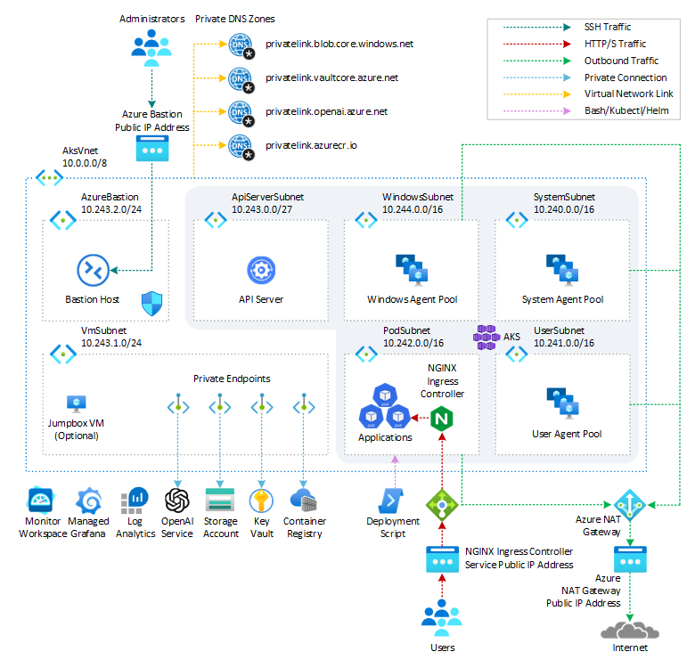
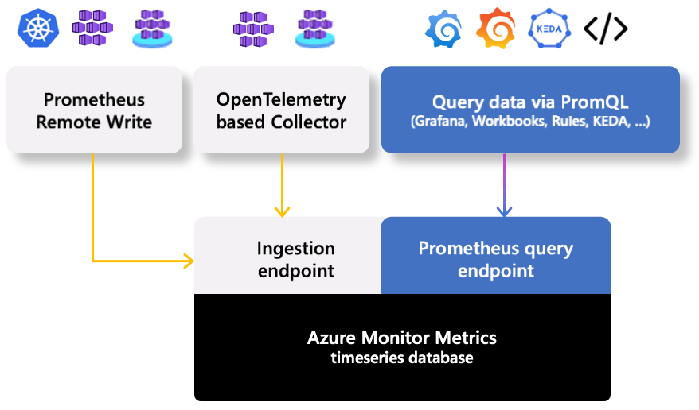

# How to create an AKS cluster with Azure Managed Prometheus and Azure Managed Grafana via Bicep

Monitoring the health and performance of an [Azure Kubernetes Service(AKS)](https://docs.microsoft.com/en-us/azure/aks/intro-kubernetes) cluster effectively is a crucial task for the organizations. This ensures the stability, performance, and availability of containerized applications running on the cluster. This article shows how to deploy an [Azure Kubernetes Service(AKS)](https://docs.microsoft.com/en-us/azure/aks/intro-kubernetes) cluster, [Azure Monitor managed service for Prometheus](https://learn.microsoft.com/en-us/azure/azure-monitor/essentials/prometheus-metrics-overview), and [Azure Managed Grafana](https://learn.microsoft.com/en-us/azure/managed-grafana/overview) for monitoring the performance and health status of the cluster and workloads. The article also shows how to:

- Deploy the [NGINX Ingress Controller](https://docs.nginx.com/nginx-ingress-controller/) via [Helm](https://docs.nginx.com/nginx-ingress-controller/installation/installation-with-helm) and configure it to expose metrics in [Prometheus](https://prometheus.io/) format.
- Create an [Azure Managed Grafana](https://learn.microsoft.com/en-us/azure/managed-grafana/overview) dashboard to analyze [NGINX Ingress Controller](https://docs.nginx.com/nginx-ingress-controller/) metrics.
- Configure the [Azure Kubernetes Service(AKS) Network Observability](hhttps://learn.microsoft.com/en-us/azure/aks/network-observability-overview)
- Create an [Azure Managed Grafana](https://learn.microsoft.com/en-us/azure/managed-grafana/overview) dashboard to visualize Network Observability metrics in Prometheus format.

## Prerequisites

- An active [Azure subscription](https://docs.microsoft.com/en-us/azure/guides/developer/azure-developer-guide#understanding-accounts-subscriptions-and-billing). If you don't have one, create a [free Azure account](https://azure.microsoft.com/free/) before you begin.
- [Visual Studio Code](https://code.visualstudio.com/) installed on one of the [supported platforms](https://code.visualstudio.com/docs/supporting/requirements#_platforms) along with the [Bicep extension](https://marketplace.visualstudio.com/items?itemName=ms-azuretools.vscode-bicep).
- Azure CLI version 2.50.0 or later installed. to install or upgrade, see [Install Azure CLI](https://learn.microsoft.com/en-us/cli/azure/install-azure-cli).
- `aks-preview` Azure CLI extension of version 0.5.145 or later installed

You can run `az --version` to verify the above version. Run the following command to install the aks-preview extension:

```bash
az extension add --name aks-preview
```

Run the following command to update to the latest version of the extension released:

```bash
az extension update --name aks-preview
```

## Architecture

This sample provides a set of Bicep modules to deploy an [Azure Kubernetes Service(AKS)](https://docs.microsoft.com/en-us/azure/aks/intro-kubernetes) cluster, an [Azure Monitor managed service for Prometheus](https://learn.microsoft.com/en-us/azure/azure-monitor/essentials/prometheus-metrics-overview) resource and an [Azure Managed Grafana](https://learn.microsoft.com/en-us/azure/managed-grafana/overview) instance for monitoring the performance and health status of the cluster and workloads. The following diagram shows the architecture and network topology deployed by the sample:



Bicep modules are parametric, so you can choose any network plugin:

- [Azure CNI with static IP allocation](https://learn.microsoft.com/en-us/azure/aks/configure-azure-cni)
- [Azure CNI with dynamic IP allocation](https://learn.microsoft.com/en-us/azure/aks/configure-azure-cni-dynamic-ip-allocation)
- [Azure CNI Powered by Cilium](https://learn.microsoft.com/en-us/azure/aks/azure-cni-powered-by-cilium)
- [Azure CNI Overlay](https://learn.microsoft.com/en-us/azure/aks/azure-cni-overlay)
- [BYO CNI](https://learn.microsoft.com/en-us/azure/aks/use-byo-cni?tabs=azure-cli)
- [Kubenet](https://learn.microsoft.com/en-us/azure/aks/configure-kubenet)

In addition, this sample shows how to deploy an [Azure Kubernetes Service](https://docs.microsoft.com/en-us/azure/aks/intro-kubernetes) cluster with the following extensions and features:

- [Istio-based service mesh add-on for Azure Kubernetes Service](https://learn.microsoft.com/en-us/azure/aks/istio-about) provides an officially supported and tested [Istio](https://istio.io/v1.1/docs/concepts/what-is-istio/) integration for Azure Kubernetes Service (AKS).
- [API Server VNET Integration](https://learn.microsoft.com/en-us/azure/aks/api-server-vnet-integration) allows you to enable network communication between the API server and the cluster nodes without requiring a private link or tunnel. AKS clusters with API Server VNET integration provide a series of advantages, for example, they can have public network access or private cluster mode enabled or disabled without redeploying the cluster. For more information, see [Create an Azure Kubernetes Service cluster with API Server VNet Integration](https://learn.microsoft.com/en-us/azure/aks/api-server-vnet-integration).
- [Azure NAT Gateway](https://learn.microsoft.com/en-us/azure/virtual-network/nat-gateway/nat-overview) to manage outbound connections initiated by AKS-hosted workloads.
- [Event-driven Autoscaling (KEDA) add-on](https://learn.microsoft.com/en-us/azure/aks/keda-about) is a single-purpose and lightweight component that strives to make application autoscaling simple and is a CNCF Incubation project.
- [Dapr extension for Azure Kubernetes Service (AKS)](https://learn.microsoft.com/en-us/azure/aks/dapr) allows you to install [Dapr](https://dapr.io/), a portable, event-driven runtime that simplifies building resilient, stateless, and stateful applications that run on the cloud and edge and embrace the diversity of languages and developer frameworks. With its sidecar architecture, Dapr helps you tackle the challenges that come with building microservices and keeps your code platform agnostic.
- [Flux V2 extension](https://learn.microsoft.com/en-us/azure/azure-arc/kubernetes/tutorial-use-gitops-flux2?tabs=azure-cli) allows to deploy workloads to an Azure Kubernetes Service (AKS) cluster via [GitOps](https://www.weave.works/technologies/gitops/). For more information, see [GitOps Flux v2 configurations with AKS and Azure Arc-enabled Kubernetes](https://learn.microsoft.com/en-us/azure/azure-arc/kubernetes/conceptual-gitops-flux2)
- [Vertical Pod Autoscaling](https://learn.microsoft.com/en-us/azure/aks/vertical-pod-autoscaler) allows you to automatically sets resource requests and limits on containers per workload based on past usage. VPA makes certain pods are scheduled onto nodes that have the required CPU and memory resources. For more information, see [Kubernetes Vertical Pod Autoscaling](https://itnext.io/k8s-vertical-pod-autoscaling-fd9e602cbf81).
- [Azure Key Vault Provider for Secrets Store CSI Driver](https://learn.microsoft.com/en-us/azure/aks/csi-secrets-store-identity-access) provides a variety of methods of identity-based access to your [Azure Key Vault](https://learn.microsoft.com/en-us/azure/key-vault/general/overview).
- [Image Cleaner](https://learn.microsoft.com/en-us/azure/aks/image-cleaner?tabs=azure-cli) to clean up stale images on your Azure Kubernetes Service cluster.
- [Azure Kubernetes Service (AKS) Network Observability](https://learn.microsoft.com/en-us/azure/aks/network-observability-overview) is an important part of maintaining a healthy and performant Kubernetes cluster. By collecting and analyzing data about network traffic, you can gain insights into how your cluster is operating and identify potential problems before they cause outages or performance degradation.
- [Windows Server node pool](https://learn.microsoft.com/en-us/azure/aks/create-node-pools#windows-server-node-pools-with-containerd) allows running [Windows Server containers on an Azure Kubernetes Service (AKS) cluster](https://learn.microsoft.com/en-us/azure/aks/learn/quick-windows-container-deploy-cli).

In a production environment, we strongly recommend deploying a [private AKS cluster](https://docs.microsoft.com/en-us/azure/aks/private-clusters) with [Uptime SLA](https://docs.microsoft.com/en-us/azure/aks/uptime-sla). For more information, see [private AKS cluster with a Public DNS address](https://docs.microsoft.com/en-us/azure/aks/private-clusters#create-a-private-aks-cluster-with-a-public-dns-address). Alternatively, you can deploy a public AKS cluster and secure access to the API server using [authorized IP address ranges](https://learn.microsoft.com/en-us/azure/aks/api-server-authorized-ip-ranges).

The Bicep modules deploy the following Azure resources:

- [Microsoft.ContainerService/managedClusters](https://learn.microsoft.com/en-us/azure/templates/microsoft.containerservice/managedclusters?pivots=deployment-language-bicep): A public or private [Azure Kubernetes Service(AKS)](https://docs.microsoft.com/en-us/azure/aks/intro-kubernetes) cluster composed of a:
  - A `system` node pool in a dedicated subnet. The default node pool hosts only critical system pods and services. The worker nodes have node taint which prevents application pods from beings scheduled on this node pool.
  - A `user` node pool hosting user workloads and artifacts in a dedicated subnet.
  - A `windows` node pool hosting Windows Server containers. This node pool is optionally created when the value of the `windowsAgentPoolEnabled` equals `true`
- [Microsoft.ManagedIdentity/userAssignedIdentities](https://learn.microsoft.com/en-us/azure/templates/microsoft.managedidentity/2018-11-30/userassignedidentities?pivots=deployment-language-bicep): a user-defined managed identity used by the AKS cluster to create additional resources like load balancers and managed disks in Azure.
- [Microsoft.Compute/virtualMachines](https://docs.microsoft.com/en-us/azure/templates/microsoft.compute/virtualmachines): Bicep modules can optionally create a jump-box virtual machine to manage the private AKS cluster.
- [Microsoft.Network/bastionHosts](https://docs.microsoft.com/en-us/azure/templates/microsoft.network/bastionhosts): a separate Azure Bastion is deployed in the AKS cluster virtual network to provide SSH connectivity to both agent nodes and virtual machines.
- [Microsoft.Network/natGateways](https://learn.microsoft.com/en-us/azure/templates/microsoft.network/natgateways?pivots=deployment-language-bicep): a bring-your-own (BYO) [Azure NAT Gateway](https://learn.microsoft.com/en-us/azure/virtual-network/nat-gateway/nat-overview) to manage outbound connections initiated by AKS-hosted workloads. The NAT Gateway is associated to the `SystemSubnet`, `UserSubnet`, and `PodSubnet` subnets. The [outboundType](https://learn.microsoft.com/en-us/azure/aks/egress-outboundtype#outbound-type-of-managednatgateway-or-userassignednatgateway) property of the cluster is set to `userAssignedNatGateway` to specify that a BYO NAT Gateway is used for outbound connections. NOTE: you can update the `outboundType` after cluster creation and this will deploy or remove resources as required to put the cluster into the new egress configuration. For more information, see [Updating outboundType after cluster creation](https://learn.microsoft.com/en-us/azure/aks/egress-outboundtype#updating-outboundtype-after-cluster-creation-preview).
- [Microsoft.Storage/storageAccounts](https://docs.microsoft.com/en-us/azure/templates/microsoft.storage/storageaccounts): this storage account is used to store the boot diagnostics logs of both the service provider and service consumer virtual machines. Boot Diagnostics is a debugging feature that allows you to view console output and screenshots to diagnose virtual machine status.
- [Microsoft.ContainerRegistry/registries](https://learn.microsoft.com/en-us/azure/templates/microsoft.containerregistry/registries?pivots=deployment-language-bicep): an Azure Container Registry (ACR) to build, store, and manage container images and artifacts in a private registry for all container deployments.
- [Microsoft.KeyVault/vaults](https://learn.microsoft.com/en-us/azure/templates/microsoft.keyvault/vaults?pivots=deployment-language-bicep): an Azure Key Vault used to store secrets, certificates, and keys that can be mounted as files by pods using [Azure Key Vault Provider for Secrets Store CSI Driver](https://github.com/Azure/secrets-store-csi-driver-provider-azure). For more information, see [Use the Azure Key Vault Provider for Secrets Store CSI Driver in an AKS cluster](https://learn.microsoft.com/en-us/azure/aks/csi-secrets-store-driver) and [Provide an identity to access the Azure Key Vault Provider for Secrets Store CSI Driver](https://learn.microsoft.com/en-us/azure/aks/csi-secrets-store-identity-access).
- [Microsoft.Network/privateEndpoints](https://docs.microsoft.com/en-us/azure/templates/microsoft.network/privateendpoints): an [Azure Private Endpoint](https://docs.microsoft.com/en-us/azure/private-link/private-endpoint-overview) is created for each of the following resources:
  - Azure OpenAI Service
  - Azure Container Registry
  - Azure Key Vault
  - Azure Storage Account
  - API Server when deploying a private AKS cluster.
- [Microsoft.Network/privateDnsZones](https://docs.microsoft.com/en-us/azure/templates/microsoft.network/privatednszones): an [Azure Private DNS Zone](https://docs.microsoft.com/en-us/azure/dns/private-dns-overview) is created for each of the following resources:
  - Azure OpenAI Service
  - Azure Container Registry
  - Azure Key Vault
  - Azure Storage Account
  - API Server when deploying a private AKS cluster.
- [Microsoft.Network/networkSecurityGroups](https://docs.microsoft.com/en-us/azure/templates/microsoft.network/networksecuritygroups?tabs=bicep): subnets hosting virtual machines and Azure Bastion Hosts are protected by [Azure Network Security Groups](https://docs.microsoft.com/en-us/azure/virtual-network/network-security-groups-overview) that are used to filter inbound and outbound traffic.
- [Microsoft.Monitor/accounts](https://learn.microsoft.com/en-us/azure/azure-monitor/essentials/azure-monitor-workspace-overview): An [Azure Monitor workspace](https://learn.microsoft.com/en-us/azure/azure-monitor/essentials/azure-monitor-workspace-overview) is a unique environment for data collected by [Azure Monitor](https://learn.microsoft.com/en-us/azure/azure-monitor/essentials/data-platform-metrics). Each workspace has its own data repository, configuration, and permissions. Log Analytics workspaces contain logs and metrics data from multiple Azure resources, whereas Azure Monitor workspaces currently contain only metrics related to [Prometheus](https://learn.microsoft.com/en-us/azure/azure-monitor/essentials/prometheus-metrics-overview). Azure Monitor managed service for Prometheus allows you to collect and analyze metrics at scale using a Prometheus-compatible monitoring solution, based on the [Prometheus](https://aka.ms/azureprometheus-promio). This fully managed service allows you to use the [Prometheus query language (PromQL)](https://aka.ms/azureprometheus-promio-promql) to analyze and alert on the performance of monitored infrastructure and workloads without having to operate the underlying infrastructure. The primary method for visualizing Prometheus metrics is [Azure Managed Grafana](https://learn.microsoft.com/en-us/azure/managed-grafana/overview). You can connect your [Azure Monitor workspace](https://learn.microsoft.com/en-us/azure/azure-monitor/essentials/azure-monitor-workspace-overview) to an [Azure Managed Grafana](https://learn.microsoft.com/en-us/azure/managed-grafana/overview) to visualize Prometheus metrics using a set of built-in and custom Grafana dashboards.
- [Microsoft.Dashboard/grafana](https://learn.microsoft.com/en-us/azure/templates/microsoft.dashboard/grafana?pivots=deployment-language-bicep): an [Azure Managed Grafana](https://learn.microsoft.com/en-us/azure/managed-grafana/overview) instance used to visualize the [Prometheus metrics](https://learn.microsoft.com/en-us/azure/azure-monitor/containers/prometheus-metrics-enable?tabs=azure-portal) generated by the [Azure Kubernetes Service(AKS)](https://docs.microsoft.com/en-us/azure/aks/intro-kubernetes) cluster deployed by the Bicep modules. Azure Managed Grafana](<https://learn.microsoft.com/en-us/azure/managed-grafana/overview>) is a fully managed service for analytics and monitoring solutions. It's supported by Grafana Enterprise, which provides extensible data visualizations. This managed service allows to quickly and easily deploy Grafana dashboards with built-in high availability and control access with Azure security.
- [Microsoft.OperationalInsights/workspaces](https://docs.microsoft.com/en-us/azure/templates/microsoft.operationalinsights/workspaces): a centralized [Azure Log Analytics](https://docs.microsoft.com/en-us/azure/azure-monitor/logs/log-analytics-workspace-overview) workspace is used to collect the diagnostics logs and metrics from all the Azure resources:
  - Azure OpenAI Service
  - Azure Kubernetes Service cluster
  - Azure Key Vault
  - Azure Network Security Group
  - Azure Container Registry
  - Azure Storage Account
  - Azure jump-box virtual machine
- [Microsoft.Resources/deploymentScripts](https://learn.microsoft.com/en-us/azure/templates/microsoft.resources/deploymentscripts?pivots=deployment-language-bicep): a deployment script is used to run the `install-nginx-with-prometheus-metrics-and-create-sa.sh` Bash script that creates the namespace and service account for the sample application and installs the following packages to the AKS cluster via [Helm](https://helm.sh/). For more information on deployment scripts, see [Use deployment scripts in Bicep](https://learn.microsoft.com/en-us/azure/azure-resource-manager/bicep/deployment-script-bicep)
  - [NGINX Ingress Controller](https://docs.nginx.com/nginx-ingress-controller/)
  - [Cert-Manager](https://cert-manager.io/docs/)
- [Microsoft.Insights/actionGroups](https://learn.microsoft.com/en-us/azure/templates/microsoft.insights/actiongroups?pivots=deployment-language-bicep): an [Azure Action Group](https://learn.microsoft.com/en-us/azure/azure-monitor/alerts/action-groups) to send emails and SMS notifications to system administrators when alerts are triggered.

The Bicep modules allow to deploy the following resources optionally:

- [Microsoft.CognitiveServices/accounts](https://learn.microsoft.com/en-us/azure/templates/microsoft.cognitiveservices/accounts?pivots=deployment-language-bicep): an [Azure OpenAI Service](https://learn.microsoft.com/en-us/azure/cognitive-services/openai/overview) with a [GPT-3.5](https://learn.microsoft.com/en-us/azure/cognitive-services/openai/concepts/models#chatgpt-gpt-35-turbo) model used by an AI application like a chatbot. Azure OpenAI Service gives customers advanced language AI with OpenAI GPT-4, GPT-3, Codex, and DALL-E models with Azure's security and enterprise promise. Azure OpenAI co-develops the APIs with OpenAI, ensuring compatibility and a smooth transition from one to the other.
- [Microsoft.ManagedIdentity/userAssignedIdentities](https://learn.microsoft.com/en-us/azure/templates/microsoft.managedidentity/2018-11-30/userassignedidentities?pivots=deployment-language-bicep): a user-defined managed identity used by the chatbot application to acquire a security token via [Azure AD workload identity](https://learn.microsoft.com/en-us/azure/aks/workload-identity-overview) to call the [Chat Completion API](https://platform.openai.com/docs/api-reference/chat) of the [ChatGPT model](https://learn.microsoft.com/en-us/azure/cognitive-services/openai/concepts/models#chatgpt-gpt-35-turbo) provided by the [Azure OpenAI Service](https://learn.microsoft.com/en-us/azure/cognitive-services/openai/overview).

> **NOTE**  
> You can find the `architecture.vsdx` file used for the diagram under the `visio` folder.

## What is Bicep?

[Bicep](https://docs.microsoft.com/en-us/azure/azure-resource-manager/bicep/overview) is a domain-specific language (DSL) that uses a declarative syntax to deploy Azure resources. It provides concise syntax, reliable type safety, and support for code reuse. Bicep offers the best authoring experience for your infrastructure-as-code solutions in Azure.

## Azure Monitor managed service for Prometheus?

[Azure Monitor managed service for Prometheus](https://learn.microsoft.com/en-us/azure/azure-monitor/essentials/prometheus-metrics-overview) is a fully managed, highly scalable, and reliable monitoring service available in Azure. It offers a turnkey solution for collecting, querying, and alerting on metrics from AKS clusters. With Azure Managed Prometheus, you no  longer need to deploy and manage Prometheus and Grafana within your clusters using a Helm chart. Instead, you can focus on extracting meaningful insights from the collected metrics. You can use a single Azure Monitor workspace to collect Prometheus metrics from a group of AKS clusters and use a single Azure Managed Grafana as a single pan of glass to visualize and aggregate Prometheus metrics collected in the Azure Monitor workspace from one or multiple AKS clusters.

The following figure shows the Azure Monitor managed service for Prometheus overview diagram:



For more information on Azure Monitor workspace and Azure Managed Prometheus, see the following articles:

- [Azure Monitor managed service for Prometheus](https://learn.microsoft.com/en-us/azure/azure-monitor/essentials/prometheus-metrics-overview)
- [Collect Prometheus metrics from an AKS cluster](https://learn.microsoft.com/en-us/azure/azure-monitor/containers/prometheus-metrics-enable)
- [Disable Prometheus metrics collection from an AKS cluster](https://learn.microsoft.com/en-us/azure/azure-monitor/containers/prometheus-metrics-disable)
- [Collect Prometheus metrics from an Arc-enabled Kubernetes cluster](https://learn.microsoft.com/en-us/azure/azure-monitor/containers/prometheus-metrics-from-arc-enabled-cluster?tabs=portal)
- [Default Prometheus metrics configuration in Azure Monitor](https://learn.microsoft.com/en-us/azure/azure-monitor/containers/prometheus-metrics-scrape-default)
- [Customize scraping of Prometheus metrics in Azure Monitor managed service for Prometheus](https://learn.microsoft.com/en-us/azure/azure-monitor/containers/prometheus-metrics-scrape-configuration)
- [Create and validate custom configuration file for Prometheus metrics in Azure Monitor](https://learn.microsoft.com/en-us/azure/azure-monitor/containers/prometheus-metrics-scrape-validate)
- [Minimal ingestion profile for Prometheus metrics in Azure Monitor](https://learn.microsoft.com/en-us/azure/azure-monitor/containers/prometheus-metrics-scrape-configuration-minimal)
- [Scrape Prometheus metrics at scale in Azure Monitor](https://learn.microsoft.com/en-us/azure/azure-monitor/containers/prometheus-metrics-scrape-scale)
- [Send Prometheus metrics to multiple Azure Monitor workspaces](https://learn.microsoft.com/en-us/azure/azure-monitor/containers/prometheus-metrics-multiple-workspaces)
- [Troubleshoot collection of Prometheus metrics in Azure Monitor](https://learn.microsoft.com/en-us/azure/azure-monitor/containers/prometheus-metrics-troubleshoot)
- [Configure remote write for Azure Monitor managed service for Prometheus using managed identity authentication](https://learn.microsoft.com/en-us/azure/azure-monitor/containers/prometheus-remote-write-managed-identity)
- [Integrate KEDA with your Azure Kubernetes Service cluster](https://learn.microsoft.com/en-us/azure/azure-monitor/containers/integrate-keda)
- [Prometheus Azure Active Directory authorization proxy](https://learn.microsoft.com/en-us/azure/azure-monitor/containers/prometheus-authorization-proxy?tabs=remote-write-example)

## Azure Managed Grafana

[Azure Managed Grafana](https://learn.microsoft.com/en-us/azure/managed-grafana/overview) is a managed service that provides a comprehensive data visualization platform built on top of the Grafana software by Grafana Labs. It's built as a fully managed Azure service operated and supported by Microsoft. Grafana helps you bring together metrics, logs and traces into a single user interface. With its extensive support for data sources and graphing capabilities, you can view and analyze your application and infrastructure telemetry data in real-time.

Azure Managed Grafana is optimized for the Azure environment. It works seamlessly with many Azure services and provides the following integration features:

- Built-in support for [Azure Managed Prometheus](https://learn.microsoft.com/en-us/azure/azure-monitor/essentials/prometheus-grafana) and [Azure Data Explorer](https://learn.microsoft.com/en-us/azure/data-explorer/).
- User authentication and access control using Azure Active Directory identities.
- Direct import of existing charts from the Azure portal.

In particular, by integrating with [Azure Monitor managed service for Prometheus](https://learn.microsoft.com/en-us/azure/azure-monitor/essentials/prometheus-metrics-overview), [Azure Managed Grafana](https://learn.microsoft.com/en-us/azure/azure-monitor/essentials/prometheus-grafana) allows you to create rich and customizable dashboards to visualize the Prometheus metrics collected in an Azure Monitor workspace from one or more AKS clusters. Azure Managed Grafana enables you to gain deep visibility into your AKS clusters, troubleshoot issues, and make informed decisions based on real-time data.  You can also set up [Azure Monitor alerts](https://learn.microsoft.com/en-us/azure/azure-monitor/alerts/alerts-overview) and use them with [Azure Managed Grafana](https://learn.microsoft.com/en-us/azure/managed-grafana/how-to-use-azure-monitor-alerts). 

For more information on Azure Managed Grafana, see the following articles:

- [What is Azure Managed Grafana?](https://learn.microsoft.com/en-us/azure/managed-grafana/overview)
- [Azure Managed Grafana service reliability](https://learn.microsoft.com/en-us/azure/managed-grafana/high-availability)
- [Use Azure Monitor managed service for Prometheus as data source for Grafana using managed system identity](https://learn.microsoft.com/en-us/azure/azure-monitor/essentials/prometheus-grafana)
- [Set up Azure Managed Grafana authentication and permissions](https://learn.microsoft.com/en-us/azure/managed-grafana/how-to-authentication-permissions?tabs=azure-portal)
- [How to configure data sources for Azure Managed Grafana](https://learn.microsoft.com/en-us/azure/managed-grafana/how-to-data-source-plugins-managed-identity?tabs=azure-portal)
- [Create a dashboard in Azure Managed Grafana](https://learn.microsoft.com/en-us/azure/managed-grafana/how-to-create-dashboard?tabs=azure-portal)
- [Use Azure Monitor alerts with Grafana](https://learn.microsoft.com/en-us/azure/managed-grafana/how-to-use-azure-monitor-alerts)
- [Set up private access using Azure Private Endpoints](https://learn.microsoft.com/en-us/azure/managed-grafana/how-to-set-up-private-access?tabs=azure-portal)
- [Connect to a data source privately using Azure Private Endpoints](https://learn.microsoft.com/en-us/azure/managed-grafana/how-to-connect-to-data-source-privately)
- [Enable zone redundancy in Azure Managed Grafana](https://learn.microsoft.com/en-us/azure/managed-grafana/how-to-enable-zone-redundancy?tabs=azure-portal)
- [Troubleshoot issues for Azure Managed Grafana](https://learn.microsoft.com/en-us/azure/managed-grafana/troubleshoot-managed-grafana)
- [Grafana user interface](https://learn.microsoft.com/en-us/azure/managed-grafana/grafana-app-ui)

## Data Collection Rules of an Azure Monitor Workspace

[Data collection rules (DCRs)](https://learn.microsoft.com/en-us/azure/azure-monitor/essentials/data-collection-rule-overview) define the data collection process in Azure Monitor. Data collection rules (DCRs) specify what data should be collected, how to transform that data, and where to send that data. Some DCRs will be created and managed by Azure Monitor to collect a specific set of data to enable insights and visualizations. However, you can also create your own DCRs to define the set of data required for other scenarios.

Azure Monitor workspace, when combined with Azure Managed Prometheus, allows you to define [Data Collection Rules (DCRs)](https://learn.microsoft.com/en-us/azure/azure-monitor/essentials/data-collection-rule-overview). These rules specify which metrics to collect and from which sources within the AKS cluster. By tailoring the data collection rules, you can focus on capturing the specific metrics that are most relevant to your monitoring needs.

Data collection rules can also be used to configure the Container Insights extension for an AKS cluster and configure an Azure Log Analytics workspace as a destination for the logs and metrics collected by Azure Monitor Agents on AKS.

## Data Collection Endpoints of an Azure Monitor Workspace

Azure Monitor workspace provides data collection endpoints that enable AKS clusters to send their metrics to a central location. By configuring the clusters to forward metrics to the Azure Monitor workspace, you ensure that all the necessary data is collected and available for further analysis. When you configure your Azure Kubernetes Service (AKS) cluster to send data to an Azure Monitor workspace, a containerized version of the Azure Monitor agent is installed in the `kube-system` namespace with a metrics extension. The Azure Monitor metrics agent's architecture utilizes a ReplicaSet and a DaemonSet. The ReplicaSet pod scrapes cluster-wide targets such as `kube-state-metrics` and custom application targets that are specified. The DaemonSet pods scrape targets solely on the node that the respective pod is deployed on, such as `node-exporter``. Data collection endpoints are used by the data collection rules for ingesting Prometheus metrics from the Azure Monitor metrics agents running on your AKS clusters.

## Azure Monitor managed service for Prometheus Rule Groups

Azure Managed Prometheus offers rule groups comprising alert and recording rules. These rule groups provide powerful capabilities to define conditions for recording metrics and triggering alerts:

- [Prometheus Recording rules](https://aka.ms/azureprometheus-promio-recrules) allow you to precompute frequently needed or computationally extensive expressions and store their result as a new set of time series. Time series created by recording rules are ingested back to your Azure Monitor workspace as new Prometheus metrics.
- [Prometheus Alert rules](https://aka.ms/azureprometheus-promio-alertrules) let you create an Azure Monitor alert based on the results of a Prometheus Query Language (Prom QL) query. Alerts fired by Azure Managed Prometheus alert rules are processed and trigger notifications in similar way to other Azure Monitor alerts.

Azure Managed Prometheus rule groups, recording rules and alert rules can be created and configured using the [Microsoft.AlertsManagement/prometheusRuleGroups](https://learn.microsoft.com/en-us/azure/templates/microsoft.alertsmanagement/prometheusrulegroups?pivots=deployment-language-bicep) resource type. Prometheus rule groups are defined with a scope of a specific Azure Monitor workspace. Prometheus rule groups can be created using Bicep, Azure Resource Manager (ARM) templates, Terraform, API, Azure CLI, or PowerShell. For more information, see [Azure Monitor managed service for Prometheus rule groups](https://learn.microsoft.com/en-us/azure/azure-monitor/essentials/prometheus-rule-groups).

## Azure Managed Prometheus vs. Azure Log Analytics

[Azure Log Analytics](https://learn.microsoft.com/en-us/azure/azure-monitor/logs/log-analytics-overview), [Container Insights](https://learn.microsoft.com/en-us/azure/azure-monitor/containers/container-insights-overview), [Azure Managed Prometheus](https://learn.microsoft.com/en-us/azure/azure-monitor/essentials/prometheus-metrics-overview), and [Azure Managed Grafana]((https://learn.microsoft.com/en-us/azure/managed-grafana/overview)) are all monitoring and observability solutions available in Azure. Here is a comparison between them:

### Functionality

- `Azure Log Analytics`: It's a versatile data collection, analysis, and visualization tool. It mainly focuses on the analysis of the diagnostic logs generated by Azure services, but can also handle metrics and provides advanced querying capabilities via the [Kusto Query Language (KQL)](https://learn.microsoft.com/en-us/azure/data-explorer/kusto/query/).
- `Container Insights`: It's a comprehensive monitoring solution specifically designed for Kubernetes clusters. It collects metrics, logs, and metadata about containers, nodes, and orchestrators. It offers features like performance analysis, auto-scaling recommendations, and anomaly detection. Container insights stores its data in a Log Analytics workspace.
- `Azure Managed Prometheus`: It is a managed version of the open-source monitoring system Prometheus. It collects time-series metrics data and supports powerful querying and visualization features.
- `Azure Managed Grafana`: It is a managed version of the popular visualization tool Grafana. It provides customizable dashboards and visualizations for metrics and logs data.

### Integration

- `Azure Log Analytics`: It integrates well with other Azure services and can collect data from various sources including Azure Monitor, Azure Kubernetes Service (AKS), Azure Functions, and more.
- `Container Insights`: It integrates tightly with Azure Log Analytics and collects memory and processor metrics generated by controllers, nodes, and containers in Azure Kubernetes Service, Azure Container Instance, or Azure-Arc enabled Kubernetes clusters.
- `Azure Managed Prometheus`: It integrates with Azure Monitor and can send metrics data directly to Azure Monitor for alerting and analysis.
- `Azure Managed Grafana`: It can connect to various data sources including Azure Monitor, Azure Log Analytics, and Azure Managed Prometheus to visualize the collected data.

### Data Collection:

- `Azure Log Analytics`: It can collect logs and metrics data from various sources like virtual machines, containers, applications, and custom data sources.
- `Container Insights`: It collects metrics, logs, and metadata specifically from Kubernetes clusters and containers.
- `Azure Managed Prometheus`: It collects time-series metrics data from applications or infrastructure components.
- `Azure Managed Grafana`: It visualizes the data collected by other monitoring solutions like Azure Monitor, Azure Log Analytics, and Azure Managed Prometheus.

### Visualization:

- `Azure Log Analytics`: It provides its visualization capabilities with query-based visualizations and advanced workbook features.
- `Container Insights`: It provides built-in visualizations and dashboards specific to Kubernetes clusters.
- `Azure Managed Prometheus`: It supports powerful graphing and visualization capabilities using [Prometheus Query Language (PromQL)](https://prometheus.io/docs/prometheus/latest/querying/basics/) and can be integrated with Grafana for more advanced visualizations.
- `Azure Managed Grafana`: It is a dedicated visualization tool that offers highly customizable and interactive dashboards.

Azure Log Analytics, Container Insights, Azure Managed Prometheus, and Azure Managed Grafana have different focuses and functionalities. While Azure Log Analytics and Container Insights are versatile monitoring solutions, Azure Managed Prometheus and Azure Managed Grafana provide specific metrics collection and visualization features. The choice between them depends on the specific monitoring needs and preferences.

## Deploy the Bicep modules

You can deploy the Bicep modules in the `bicep` folder using the `deploy.sh` Bash script in the same folder. Specify a value for the following parameters in the `deploy.sh` script and `main.parameters.json` parameters file before deploying the Bicep modules.

- `prefix`: specifies a prefix for all the Azure resources.
- `authenticationType`: specifies the type of authentication when accessing the Virtual Machine. `sshPublicKey` is the recommended value. Allowed values: `sshPublicKey` and `password`.
- `vmAdminUsername`: specifies the name of the administrator account of the virtual machine.
- `vmAdminPasswordOrKey`: specifies the SSH Key or password for the virtual machine.
- `aksClusterSshPublicKey`:  specifies the SSH Key or password for AKS cluster agent nodes.
- `aadProfileAdminGroupObjectIDs`: when deploying an AKS cluster with Azure AD and Azure RBAC integration, this array parameter contains the list of Azure AD group object IDs that will have the admin role of the cluster.
- `keyVaultObjectIds`: Specifies the object ID of the service principals to configure in Key Vault access policies.
- `windowsAgentPoolEnabled`: Specifies whether to create a Windows Server agent pool.

We suggest reading sensitive configuration data such as passwords or SSH keys from a pre-existing Azure Key Vault resource. For more information, see [Use Azure Key Vault to pass secure parameter value during Bicep deployment](https://docs.microsoft.com/en-us/azure/azure-resource-manager/bicep/key-vault-parameter?tabs=azure-cli).

## Azure Managed Prometheus Bicep Module

The following table contains the code from the `managedPrometheus.bicep` Bicep module used to deploy an [Azure Monitor managed service for Prometheus workspace](https://learn.microsoft.com/en-us/azure/azure-monitor/essentials/prometheus-metrics-overview).

```bicep
// Parameters
@description('Specifies the name of the Azure Monitor managed service for Prometheus resource.')
param name string

@description('Specifies the location of the Azure Monitor managed service for Prometheus resource.')
param location string = resourceGroup().location

@description('Specifies the name of the AKS cluster.')
param clusterName string

@description('Specifies whether or not public endpoint access is allowed for the Azure Monitor managed service for Prometheus resource.')
@allowed([
  'Enabled'
  'Disabled'
])
param publicNetworkAccess string = 'Enabled'

@description('Specifies the resource id of an Action Group resource. If empty, no action is specifies for metric alerts.')
param actionGroupId string = ''

@description('Specifies the resource tags for the Azure Monitor managed service for Prometheus resource.')
param tags object

// Variables
var nodeRecordingRuleGroupPrefix = 'NodeRecordingRulesRuleGroup-'
var nodeRecordingRuleGroupName = '${nodeRecordingRuleGroupPrefix}${clusterName}'
var nodeRecordingRuleGroupDescription = 'Node Recording Rules RuleGroup'
var kubernetesRecordingRuleGrouPrefix = 'KubernetesRecordingRulesRuleGroup-'
var kubernetesRecordingRuleGroupName = '${kubernetesRecordingRuleGrouPrefix}${clusterName}'
var kubernetesRecordingRuleGroupDescription = 'Kubernetes Recording Rules RuleGroup'
var nodeRecordingRuleGroupWin = 'NodeRecordingRulesRuleGroup-Win-'
var nodeAndKubernetesRecordingRuleGroupWin = 'NodeAndKubernetesRecordingRulesRuleGroup-Win-'
var nodeRecordingRuleGroupNameWinName = '${nodeRecordingRuleGroupWin}${clusterName}'
var nodeAndKubernetesRecordingRuleGroupWinName = '${nodeAndKubernetesRecordingRuleGroupWin}${clusterName}'
var RecordingRuleGroupDescriptionWin = 'Recording Rules RuleGroup for Win'
var version = ' - 0.1'

// Resources
resource aksCluster 'Microsoft.ContainerService/managedClusters@2023-06-02-preview' existing = {
  name: clusterName
}

resource azureMonitorWorkspace 'Microsoft.Monitor/accounts@2023-04-03' = {
  name: name
  location: location
  tags: tags
}

resource dataCollectionEndpoint 'Microsoft.Insights/dataCollectionEndpoints@2022-06-01' = {
  name: 'MSProm-${location}-${clusterName}'
  location: location
  kind: 'Linux'
  tags: tags
  properties: {
    networkAcls: {
      publicNetworkAccess: publicNetworkAccess
    }
  }
}

resource dataCollectionRule 'Microsoft.Insights/dataCollectionRules@2022-06-01' = {
  name: 'MSProm-${location}-${clusterName}'
  location: location
  tags: tags

  properties: {
    dataCollectionEndpointId: dataCollectionEndpoint.id
    dataSources: {
      prometheusForwarder: [
        {
          name: 'PrometheusDataSource'
          streams: [
            'Microsoft-PrometheusMetrics'
          ]
          labelIncludeFilter: {}
        }
      ]
    }
    destinations: {
      monitoringAccounts: [
        {
          accountResourceId: azureMonitorWorkspace.id
          name: 'MonitoringAccount1'
        }
      ]
    }
    dataFlows: [
      {
        streams: [
          'Microsoft-PrometheusMetrics'
        ]
        destinations: [
          'MonitoringAccount1'
        ]
      }
    ]
  }
}

resource dataCollectionRuleAssociation 'Microsoft.Insights/dataCollectionRuleAssociations@2022-06-01' = {
  name: 'MSProm-${location}-${clusterName}'
  scope: aksCluster
  properties: {
    dataCollectionRuleId: dataCollectionRule.id
    description: 'Association of data collection rule. Deleting this association will break the data collection for this AKS Cluster.'
  }
}

resource nodeRecordingRuleGroup 'Microsoft.AlertsManagement/prometheusRuleGroups@2023-03-01' = {
  name: nodeRecordingRuleGroupName
  location: location
  properties: {
    description: '${nodeRecordingRuleGroupDescription}${version}'
    scopes: [
      azureMonitorWorkspace.id
    ]
    enabled: true
    clusterName: clusterName
    interval: 'PT1M'
    rules: [
      {
        record: 'instance:node_num_cpu:sum'
        expression: 'count without (cpu, mode) (  node_cpu_seconds_total{job="node",mode="idle"})'
      }
      {
        record: 'instance:node_cpu_utilisation:rate5m'
        expression: '1 - avg without (cpu) (  sum without (mode) (rate(node_cpu_seconds_total{job="node", mode=~"idle|iowait|steal"}[5m])))'
      }
      {
        record: 'instance:node_load1_per_cpu:ratio'
        expression: '(  node_load1{job="node"}/  instance:node_num_cpu:sum{job="node"})'
      }
      {
        record: 'instance:node_memory_utilisation:ratio'
        expression: '1 - (  (    node_memory_MemAvailable_bytes{job="node"}    or    (      node_memory_Buffers_bytes{job="node"}      +      node_memory_Cached_bytes{job="node"}      +      node_memory_MemFree_bytes{job="node"}      +      node_memory_Slab_bytes{job="node"}    )  )/  node_memory_MemTotal_bytes{job="node"})'
      }
      {
        record: 'instance:node_vmstat_pgmajfault:rate5m'
        expression: 'rate(node_vmstat_pgmajfault{job="node"}[5m])'
      }
      {
        record: 'instance_device:node_disk_io_time_seconds:rate5m'
        expression: 'rate(node_disk_io_time_seconds_total{job="node", device!=""}[5m])'
      }
      {
        record: 'instance_device:node_disk_io_time_weighted_seconds:rate5m'
        expression: 'rate(node_disk_io_time_weighted_seconds_total{job="node", device!=""}[5m])'
      }
      {
        record: 'instance:node_network_receive_bytes_excluding_lo:rate5m'
        expression: 'sum without (device) (  rate(node_network_receive_bytes_total{job="node", device!="lo"}[5m]))'
      }
      {
        record: 'instance:node_network_transmit_bytes_excluding_lo:rate5m'
        expression: 'sum without (device) (  rate(node_network_transmit_bytes_total{job="node", device!="lo"}[5m]))'
      }
      {
        record: 'instance:node_network_receive_drop_excluding_lo:rate5m'
        expression: 'sum without (device) (  rate(node_network_receive_drop_total{job="node", device!="lo"}[5m]))'
      }
      {
        record: 'instance:node_network_transmit_drop_excluding_lo:rate5m'
        expression: 'sum without (device) (  rate(node_network_transmit_drop_total{job="node", device!="lo"}[5m]))'
      }
    ]
  }
}

resource kubernetesRecordingRuleGroup 'Microsoft.AlertsManagement/prometheusRuleGroups@2023-03-01' = {
  name: kubernetesRecordingRuleGroupName
  location: location
  properties: {
    description: '${kubernetesRecordingRuleGroupDescription}${version}'
    scopes: [
      azureMonitorWorkspace.id
    ]
    enabled: true
    clusterName: clusterName
    interval: 'PT1M'
    rules: [
      {
        record: 'node_namespace_pod_container:container_cpu_usage_seconds_total:sum_irate'
        expression: 'sum by (cluster, namespace, pod, container) (  irate(container_cpu_usage_seconds_total{job="cadvisor", image!=""}[5m])) * on (cluster, namespace, pod) group_left(node) topk by (cluster, namespace, pod) (  1, max by(cluster, namespace, pod, node) (kube_pod_info{node!=""}))'
      }
      {
        record: 'node_namespace_pod_container:container_memory_working_set_bytes'
        expression: 'container_memory_working_set_bytes{job="cadvisor", image!=""}* on (namespace, pod) group_left(node) topk by(namespace, pod) (1,  max by(namespace, pod, node) (kube_pod_info{node!=""}))'
      }
      {
        record: 'node_namespace_pod_container:container_memory_rss'
        expression: 'container_memory_rss{job="cadvisor", image!=""}* on (namespace, pod) group_left(node) topk by(namespace, pod) (1,  max by(namespace, pod, node) (kube_pod_info{node!=""}))'
      }
      {
        record: 'node_namespace_pod_container:container_memory_cache'
        expression: 'container_memory_cache{job="cadvisor", image!=""}* on (namespace, pod) group_left(node) topk by(namespace, pod) (1,  max by(namespace, pod, node) (kube_pod_info{node!=""}))'
      }
      {
        record: 'node_namespace_pod_container:container_memory_swap'
        expression: 'container_memory_swap{job="cadvisor", image!=""}* on (namespace, pod) group_left(node) topk by(namespace, pod) (1,  max by(namespace, pod, node) (kube_pod_info{node!=""}))'
      }
      {
        record: 'cluster:namespace:pod_memory:active:kube_pod_container_resource_requests'
        expression: 'kube_pod_container_resource_requests{resource="memory",job="kube-state-metrics"}  * on (namespace, pod, cluster)group_left() max by (namespace, pod, cluster) (  (kube_pod_status_phase{phase=~"Pending|Running"} == 1))'
      }
      {
        record: 'namespace_memory:kube_pod_container_resource_requests:sum'
        expression: 'sum by (namespace, cluster) (    sum by (namespace, pod, cluster) (        max by (namespace, pod, container, cluster) (          kube_pod_container_resource_requests{resource="memory",job="kube-state-metrics"}        ) * on(namespace, pod, cluster) group_left() max by (namespace, pod, cluster) (          kube_pod_status_phase{phase=~"Pending|Running"} == 1        )    ))'
      }
      {
        record: 'cluster:namespace:pod_cpu:active:kube_pod_container_resource_requests'
        expression: 'kube_pod_container_resource_requests{resource="cpu",job="kube-state-metrics"}  * on (namespace, pod, cluster)group_left() max by (namespace, pod, cluster) (  (kube_pod_status_phase{phase=~"Pending|Running"} == 1))'
      }
      {
        record: 'namespace_cpu:kube_pod_container_resource_requests:sum'
        expression: 'sum by (namespace, cluster) (    sum by (namespace, pod, cluster) (        max by (namespace, pod, container, cluster) (          kube_pod_container_resource_requests{resource="cpu",job="kube-state-metrics"}        ) * on(namespace, pod, cluster) group_left() max by (namespace, pod, cluster) (          kube_pod_status_phase{phase=~"Pending|Running"} == 1        )    ))'
      }
      {
        record: 'cluster:namespace:pod_memory:active:kube_pod_container_resource_limits'
        expression: 'kube_pod_container_resource_limits{resource="memory",job="kube-state-metrics"}  * on (namespace, pod, cluster)group_left() max by (namespace, pod, cluster) (  (kube_pod_status_phase{phase=~"Pending|Running"} == 1))'
      }
      {
        record: 'namespace_memory:kube_pod_container_resource_limits:sum'
        expression: 'sum by (namespace, cluster) (    sum by (namespace, pod, cluster) (        max by (namespace, pod, container, cluster) (          kube_pod_container_resource_limits{resource="memory",job="kube-state-metrics"}        ) * on(namespace, pod, cluster) group_left() max by (namespace, pod, cluster) (          kube_pod_status_phase{phase=~"Pending|Running"} == 1        )    ))'
      }
      {
        record: 'cluster:namespace:pod_cpu:active:kube_pod_container_resource_limits'
        expression: 'kube_pod_container_resource_limits{resource="cpu",job="kube-state-metrics"}  * on (namespace, pod, cluster)group_left() max by (namespace, pod, cluster) ( (kube_pod_status_phase{phase=~"Pending|Running"} == 1) )'
      }
      {
        record: 'namespace_cpu:kube_pod_container_resource_limits:sum'
        expression: 'sum by (namespace, cluster) (    sum by (namespace, pod, cluster) (        max by (namespace, pod, container, cluster) (          kube_pod_container_resource_limits{resource="cpu",job="kube-state-metrics"}        ) * on(namespace, pod, cluster) group_left() max by (namespace, pod, cluster) (          kube_pod_status_phase{phase=~"Pending|Running"} == 1        )    ))'
      }
      {
        record: 'namespace_workload_pod:kube_pod_owner:relabel'
        expression: 'max by (cluster, namespace, workload, pod) (  label_replace(    label_replace(      kube_pod_owner{job="kube-state-metrics", owner_kind="ReplicaSet"},      "replicaset", "$1", "owner_name", "(.*)"    ) * on(replicaset, namespace) group_left(owner_name) topk by(replicaset, namespace) (      1, max by (replicaset, namespace, owner_name) (        kube_replicaset_owner{job="kube-state-metrics"}      )    ),    "workload", "$1", "owner_name", "(.*)"  ))'
        labels: {
          workload_type: 'deployment'
        }
      }
      {
        record: 'namespace_workload_pod:kube_pod_owner:relabel'
        expression: 'max by (cluster, namespace, workload, pod) (  label_replace(    kube_pod_owner{job="kube-state-metrics", owner_kind="DaemonSet"},    "workload", "$1", "owner_name", "(.*)"  ))'
        labels: {
          workload_type: 'daemonset'
        }
      }
      {
        record: 'namespace_workload_pod:kube_pod_owner:relabel'
        expression: 'max by (cluster, namespace, workload, pod) (  label_replace(    kube_pod_owner{job="kube-state-metrics", owner_kind="StatefulSet"},    "workload", "$1", "owner_name", "(.*)"  ))'
        labels: {
          workload_type: 'statefulset'
        }
      }
      {
        record: 'namespace_workload_pod:kube_pod_owner:relabel'
        expression: 'max by (cluster, namespace, workload, pod) (  label_replace(    kube_pod_owner{job="kube-state-metrics", owner_kind="Job"},    "workload", "$1", "owner_name", "(.*)"  ))'
        labels: {
          workload_type: 'job'
        }
      }
      {
        record: ':node_memory_MemAvailable_bytes:sum'
        expression: 'sum(  node_memory_MemAvailable_bytes{job="node"} or  (    node_memory_Buffers_bytes{job="node"} +    node_memory_Cached_bytes{job="node"} +    node_memory_MemFree_bytes{job="node"} +    node_memory_Slab_bytes{job="node"}  )) by (cluster)'
      }
      {
        record: 'cluster:node_cpu:ratio_rate5m'
        expression: 'sum(rate(node_cpu_seconds_total{job="node",mode!="idle",mode!="iowait",mode!="steal"}[5m])) by (cluster) /count(sum(node_cpu_seconds_total{job="node"}) by (cluster, instance, cpu)) by (cluster)'
      }
    ]
  }
}

resource nodeRecordingRuleGroupNameWin 'Microsoft.AlertsManagement/prometheusRuleGroups@2023-03-01' = {
  name: nodeRecordingRuleGroupNameWinName
  location: location
  properties: {
    description: '${RecordingRuleGroupDescriptionWin}${version}'
    scopes: [
      azureMonitorWorkspace.id
    ]
    enabled: true
    clusterName: clusterName
    interval: 'PT1M'
    rules: [
      {
        record: 'node:windows_node:sum'
        expression: 'count (windows_system_system_up_time{job="windows-exporter"})'
      }
      {
        record: 'node:windows_node_num_cpu:sum'
        expression: 'count by (instance) (sum by (instance, core) (windows_cpu_time_total{job="windows-exporter"}))'
      }
      {
        record: ':windows_node_cpu_utilisation:avg5m'
        expression: '1 - avg(rate(windows_cpu_time_total{job="windows-exporter",mode="idle"}[5m]))'
      }
      {
        record: 'node:windows_node_cpu_utilisation:avg5m'
        expression: '1 - avg by (instance) (rate(windows_cpu_time_total{job="windows-exporter",mode="idle"}[5m]))'
      }
      {
        record: ':windows_node_memory_utilisation:'
        expression: '1 -sum(windows_memory_available_bytes{job="windows-exporter"})/sum(windows_os_visible_memory_bytes{job="windows-exporter"})'
      }
      {
        record: ':windows_node_memory_MemFreeCached_bytes:sum'
        expression: 'sum(windows_memory_available_bytes{job="windows-exporter"} + windows_memory_cache_bytes{job="windows-exporter"})'
      }
      {
        record: 'node:windows_node_memory_totalCached_bytes:sum'
        expression: '(windows_memory_cache_bytes{job="windows-exporter"} + windows_memory_modified_page_list_bytes{job="windows-exporter"} + windows_memory_standby_cache_core_bytes{job="windows-exporter"} + windows_memory_standby_cache_normal_priority_bytes{job="windows-exporter"} + windows_memory_standby_cache_reserve_bytes{job="windows-exporter"})'
      }
      {
        record: ':windows_node_memory_MemTotal_bytes:sum'
        expression: 'sum(windows_os_visible_memory_bytes{job="windows-exporter"})'
      }
      {
        record: 'node:windows_node_memory_bytes_available:sum'
        expression: 'sum by (instance) ((windows_memory_available_bytes{job="windows-exporter"}))'
      }
      {
        record: 'node:windows_node_memory_bytes_total:sum'
        expression: 'sum by (instance) (windows_os_visible_memory_bytes{job="windows-exporter"})'
      }
      {
        record: 'node:windows_node_memory_utilisation:ratio'
        expression: '(node:windows_node_memory_bytes_total:sum - node:windows_node_memory_bytes_available:sum) / scalar(sum(node:windows_node_memory_bytes_total:sum))'
      }
      {
        record: 'node:windows_node_memory_utilisation:'
        expression: '1 - (node:windows_node_memory_bytes_available:sum / node:windows_node_memory_bytes_total:sum)'
      }
      {
        record: 'node:windows_node_memory_swap_io_pages:irate'
        expression: 'irate(windows_memory_swap_page_operations_total{job="windows-exporter"}[5m])'
      }
      {
        record: ':windows_node_disk_utilisation:avg_irate'
        expression: 'avg(irate(windows_logical_disk_read_seconds_total{job="windows-exporter"}[5m]) + irate(windows_logical_disk_write_seconds_total{job="windows-exporter"}[5m]))'
      }
      {
        record: 'node:windows_node_disk_utilisation:avg_irate'
        expression: 'avg by (instance) ((irate(windows_logical_disk_read_seconds_total{job="windows-exporter"}[5m]) + irate(windows_logical_disk_write_seconds_total{job="windows-exporter"}[5m])))'
      }
    ]
  }
}

resource nodeAndKubernetesRecordingRuleGroupNameWin 'Microsoft.AlertsManagement/prometheusRuleGroups@2023-03-01' = {
  name: nodeAndKubernetesRecordingRuleGroupWinName
  location: location
  properties: {
    description: '${RecordingRuleGroupDescriptionWin}${version}'
    scopes: [
      azureMonitorWorkspace.id
    ]
    enabled: true
    clusterName: clusterName
    interval: 'PT1M'
    rules: [
      {
        record: 'node:windows_node_filesystem_usage:'
        expression: 'max by (instance,volume)((windows_logical_disk_size_bytes{job="windows-exporter"} - windows_logical_disk_free_bytes{job="windows-exporter"}) / windows_logical_disk_size_bytes{job="windows-exporter"})'
      }
      {
        record: 'node:windows_node_filesystem_avail:'
        expression: 'max by (instance, volume) (windows_logical_disk_free_bytes{job="windows-exporter"} / windows_logical_disk_size_bytes{job="windows-exporter"})'
      }
      {
        record: ':windows_node_net_utilisation:sum_irate'
        expression: 'sum(irate(windows_net_bytes_total{job="windows-exporter"}[5m]))'
      }
      {
        record: 'node:windows_node_net_utilisation:sum_irate'
        expression: 'sum by (instance) ((irate(windows_net_bytes_total{job="windows-exporter"}[5m])))'
      }
      {
        record: ':windows_node_net_saturation:sum_irate'
        expression: 'sum(irate(windows_net_packets_received_discarded_total{job="windows-exporter"}[5m])) + sum(irate(windows_net_packets_outbound_discarded_total{job="windows-exporter"}[5m]))'
      }
      {
        record: 'node:windows_node_net_saturation:sum_irate'
        expression: 'sum by (instance) ((irate(windows_net_packets_received_discarded_total{job="windows-exporter"}[5m]) + irate(windows_net_packets_outbound_discarded_total{job="windows-exporter"}[5m])))'
      }
      {
        record: 'windows_pod_container_available'
        expression: 'windows_container_available{job="windows-exporter", container_id != ""} * on(container_id) group_left(container, pod, namespace) max(kube_pod_container_info{job="kube-state-metrics", container_id != ""}) by(container, container_id, pod, namespace)'
      }
      {
        record: 'windows_container_total_runtime'
        expression: 'windows_container_cpu_usage_seconds_total{job="windows-exporter", container_id != ""} * on(container_id) group_left(container, pod, namespace) max(kube_pod_container_info{job="kube-state-metrics", container_id != ""}) by(container, container_id, pod, namespace)'
      }
      {
        record: 'windows_container_memory_usage'
        expression: 'windows_container_memory_usage_commit_bytes{job="windows-exporter", container_id != ""} * on(container_id) group_left(container, pod, namespace) max(kube_pod_container_info{job="kube-state-metrics", container_id != ""}) by(container, container_id, pod, namespace)'
      }
      {
        record: 'windows_container_private_working_set_usage'
        expression: 'windows_container_memory_usage_private_working_set_bytes{job="windows-exporter", container_id != ""} * on(container_id) group_left(container, pod, namespace) max(kube_pod_container_info{job="kube-state-metrics", container_id != ""}) by(container, container_id, pod, namespace)'
      }
      {
        record: 'windows_container_network_received_bytes_total'
        expression: 'windows_container_network_receive_bytes_total{job="windows-exporter", container_id != ""} * on(container_id) group_left(container, pod, namespace) max(kube_pod_container_info{job="kube-state-metrics", container_id != ""}) by(container, container_id, pod, namespace)'
      }
      {
        record: 'windows_container_network_transmitted_bytes_total'
        expression: 'windows_container_network_transmit_bytes_total{job="windows-exporter", container_id != ""} * on(container_id) group_left(container, pod, namespace) max(kube_pod_container_info{job="kube-state-metrics", container_id != ""}) by(container, container_id, pod, namespace)'
      }
      {
        record: 'kube_pod_windows_container_resource_memory_request'
        expression: 'max by (namespace, pod, container) (kube_pod_container_resource_requests{resource="memory",job="kube-state-metrics"}) * on(container,pod,namespace) (windows_pod_container_available)'
      }
      {
        record: 'kube_pod_windows_container_resource_memory_limit'
        expression: 'kube_pod_container_resource_limits{resource="memory",job="kube-state-metrics"} * on(container,pod,namespace) (windows_pod_container_available)'
      }
      {
        record: 'kube_pod_windows_container_resource_cpu_cores_request'
        expression: 'max by (namespace, pod, container) ( kube_pod_container_resource_requests{resource="cpu",job="kube-state-metrics"}) * on(container,pod,namespace) (windows_pod_container_available)'
      }
      {
        record: 'kube_pod_windows_container_resource_cpu_cores_limit'
        expression: 'kube_pod_container_resource_limits{resource="cpu",job="kube-state-metrics"} * on(container,pod,namespace) (windows_pod_container_available)'
      }
      {
        record: 'namespace_pod_container:windows_container_cpu_usage_seconds_total:sum_rate'
        expression: 'sum by (namespace, pod, container) (rate(windows_container_total_runtime{}[5m]))'
      }
    ]
  }
}

resource communityALerts 'Microsoft.AlertsManagement/prometheusRuleGroups@2021-07-22-preview' = {
  name: 'CommunityCIAlerts-${clusterName}'
  location: location
  properties: {
    description: 'Kubernetes Alert RuleGroup-communityCIAlerts - 0.1'
    scopes: [
      azureMonitorWorkspace.id
    ]
    clusterName: clusterName
    enabled: true
    interval: 'PT1M'
    rules: [
      {
        alert: 'KubePodCrashLooping'
        expression: 'max_over_time(kube_pod_container_status_waiting_reason{reason="CrashLoopBackOff", job="kube-state-metrics"}[5m]) >= 1'
        for: 'PT15M'
        labels: {
          severity: 'warning'
        }
        severity: 3
        enabled: true
        resolveConfiguration: {
          autoResolved: true
          timeToResolve: 'PT10M'
        }
        actions: [
          {
            actionGroupId: actionGroupId
          }
        ]
      }
      {
        alert: 'KubePodNotReady'
        expression: 'sum by (namespace, pod, cluster) (  max by(namespace, pod, cluster) (    kube_pod_status_phase{job="kube-state-metrics", phase=~"Pending|Unknown"}  ) * on(namespace, pod, cluster) group_left(owner_kind) topk by(namespace, pod, cluster) (    1, max by(namespace, pod, owner_kind, cluster) (kube_pod_owner{owner_kind!="Job"})  )) > 0'
        for: 'PT15M'
        labels: {
          severity: 'warning'
        }
        severity: 3
        enabled: true
        resolveConfiguration: {
          autoResolved: true
          timeToResolve: 'PT10M'
        }
        actions: [
          {
            actionGroupId: actionGroupId
          }
        ]
      }
      {
        alert: 'KubeDeploymentReplicasMismatch'
        expression: '(  kube_deployment_spec_replicas{job="kube-state-metrics"}    >  kube_deployment_status_replicas_available{job="kube-state-metrics"}) and (  changes(kube_deployment_status_replicas_updated{job="kube-state-metrics"}[10m])    ==  0)'
        for: 'PT15M'
        labels: {
          severity: 'warning'
        }
        severity: 3
        enabled: true
        resolveConfiguration: {
          autoResolved: true
          timeToResolve: 'PT10M'
        }
        actions: [
          {
            actionGroupId: actionGroupId
          }
        ]
      }
      {
        alert: 'KubeStatefulSetReplicasMismatch'
        expression: '(  kube_statefulset_status_replicas_ready{job="kube-state-metrics"}    !=  kube_statefulset_status_replicas{job="kube-state-metrics"}) and (  changes(kube_statefulset_status_replicas_updated{job="kube-state-metrics"}[10m])    ==  0)'
        for: 'PT15M'
        labels: {
          severity: 'warning'
        }
        severity: 3
        enabled: true
        resolveConfiguration: {
          autoResolved: true
          timeToResolve: 'PT10M'
        }
        actions: [
          {
            actionGroupId: actionGroupId
          }
        ]
      }
      {
        alert: 'KubeJobNotCompleted'
        expression: 'time() - max by(namespace, job_name, cluster) (kube_job_status_start_time{job="kube-state-metrics"}  and kube_job_status_active{job="kube-state-metrics"} > 0) > 43200'
        labels: {
          severity: 'warning'
        }
        severity: 3
        enabled: true
        resolveConfiguration: {
          autoResolved: true
          timeToResolve: 'PT10M'
        }
        actions: [
          {
            actionGroupId: actionGroupId
          }
        ]
      }
      {
        alert: 'KubeJobFailed'
        expression: 'kube_job_failed{job="kube-state-metrics"}  > 0'
        for: 'PT15M'
        labels: {
          severity: 'warning'
        }
        severity: 3
        enabled: true
        resolveConfiguration: {
          autoResolved: true
          timeToResolve: 'PT10M'
        }
        actions: [
          {
            actionGroupId: actionGroupId
          }
        ]
      }
      {
        alert: 'KubeHpaReplicasMismatch'
        expression: '(kube_horizontalpodautoscaler_status_desired_replicas{job="kube-state-metrics"}  !=kube_horizontalpodautoscaler_status_current_replicas{job="kube-state-metrics"})  and(kube_horizontalpodautoscaler_status_current_replicas{job="kube-state-metrics"}  >kube_horizontalpodautoscaler_spec_min_replicas{job="kube-state-metrics"})  and(kube_horizontalpodautoscaler_status_current_replicas{job="kube-state-metrics"}  <kube_horizontalpodautoscaler_spec_max_replicas{job="kube-state-metrics"})  and changes(kube_horizontalpodautoscaler_status_current_replicas{job="kube-state-metrics"}[15m]) == 0'
        for: 'PT15M'
        labels: {
          severity: 'warning'
        }
        severity: 3
        enabled: true
        resolveConfiguration: {
          autoResolved: true
          timeToResolve: 'PT10M'
        }
        actions: [
          {
            actionGroupId: actionGroupId
          }
        ]
      }
      {
        alert: 'KubeHpaMaxedOut'
        expression: 'kube_horizontalpodautoscaler_status_current_replicas{job="kube-state-metrics"}  ==kube_horizontalpodautoscaler_spec_max_replicas{job="kube-state-metrics"}'
        for: 'PT15M'
        labels: {
          severity: 'warning'
        }
        severity: 3
        enabled: true
        resolveConfiguration: {
          autoResolved: true
          timeToResolve: 'PT10M'
        }
        actions: [
          {
            actionGroupId: actionGroupId
          }
        ]
      }
      {
        alert: 'KubeCPUQuotaOvercommit'
        expression: 'sum(min without(resource) (kube_resourcequota{job="kube-state-metrics", type="hard", resource=~"(cpu|requests.cpu)"}))  /sum(kube_node_status_allocatable{resource="cpu", job="kube-state-metrics"})  > 1.5'
        for: 'PT5M'
        labels: {
          severity: 'warning'
        }
        severity: 3
        enabled: true
        resolveConfiguration: {
          autoResolved: true
          timeToResolve: 'PT10M'
        }
        actions: [
          {
            actionGroupId: actionGroupId
          }
        ]
      }
      {
        alert: 'KubeMemoryQuotaOvercommit'
        expression: 'sum(min without(resource) (kube_resourcequota{job="kube-state-metrics", type="hard", resource=~"(memory|requests.memory)"}))  /sum(kube_node_status_allocatable{resource="memory", job="kube-state-metrics"})  > 1.5'
        for: 'PT5M'
        labels: {
          severity: 'warning'
        }
        severity: 3
        enabled: true
        resolveConfiguration: {
          autoResolved: true
          timeToResolve: 'PT10M'
        }
        actions: [
          {
            actionGroupId: actionGroupId
          }
        ]
      }
      {
        alert: 'KubeQuotaAlmostFull'
        expression: 'kube_resourcequota{job="kube-state-metrics", type="used"}  / ignoring(instance, job, type)(kube_resourcequota{job="kube-state-metrics", type="hard"} > 0)  > 0.9 < 1'
        for: 'PT15M'
        labels: {
          severity: 'info'
        }
        severity: 3
        enabled: true
        resolveConfiguration: {
          autoResolved: true
          timeToResolve: 'PT10M'
        }
        actions: [
          {
            actionGroupId: actionGroupId
          }
        ]
      }
      {
        alert: 'KubeVersionMismatch'
        expression: 'count by (cluster) (count by (git_version, cluster) (label_replace(kubernetes_build_info{job!~"kube-dns|coredns"},"git_version","$1","git_version","(v[0-9]*.[0-9]*).*"))) > 1'
        for: 'PT15M'
        labels: {
          severity: 'warning'
        }
        severity: 3
        enabled: true
        resolveConfiguration: {
          autoResolved: true
          timeToResolve: 'PT10M'
        }
        actions: [
          {
            actionGroupId: actionGroupId
          }
        ]
      }
      {
        alert: 'KubeNodeNotReady'
        expression: 'kube_node_status_condition{job="kube-state-metrics",condition="Ready",status="true"} == 0'
        for: 'PT15M'
        labels: {
          severity: 'warning'
        }
        severity: 3
        enabled: true
        resolveConfiguration: {
          autoResolved: true
          timeToResolve: 'PT10M'
        }
        actions: [
          {
            actionGroupId: actionGroupId
          }
        ]
      }
      {
        alert: 'KubeNodeUnreachable'
        expression: '(kube_node_spec_taint{job="kube-state-metrics",key="node.kubernetes.io/unreachable",effect="NoSchedule"} unless ignoring(key,value) kube_node_spec_taint{job="kube-state-metrics",key=~"ToBeDeletedByClusterAutoscaler|cloud.google.com/impending-node-termination|aws-node-termination-handler/spot-itn"}) == 1'
        for: 'PT15M'
        labels: {
          severity: 'warning'
        }
        severity: 3
        enabled: true
        resolveConfiguration: {
          autoResolved: true
          timeToResolve: 'PT10M'
        }
        actions: [
          {
            actionGroupId: actionGroupId
          }
        ]
      }
      {
        alert: 'KubeletTooManyPods'
        expression: 'count by(cluster, node) (  (kube_pod_status_phase{job="kube-state-metrics",phase="Running"} == 1) * on(instance,pod,namespace,cluster) group_left(node) topk by(instance,pod,namespace,cluster) (1, kube_pod_info{job="kube-state-metrics"}))/max by(cluster, node) (  kube_node_status_capacity{job="kube-state-metrics",resource="pods"} != 1) > 0.95'
        for: 'PT15M'
        labels: {
          severity: 'info'
        }
        severity: 3
        enabled: true
        resolveConfiguration: {
          autoResolved: true
          timeToResolve: 'PT10M'
        }
        actions: [
          {
            actionGroupId: actionGroupId
          }
        ]
      }
      {
        alert: 'KubeNodeReadinessFlapping'
        expression: 'sum(changes(kube_node_status_condition{status="true",condition="Ready"}[15m])) by (cluster, node) > 2'
        for: 'PT15M'
        labels: {
          severity: 'warning'
        }
        severity: 3
        enabled: true
        resolveConfiguration: {
          autoResolved: true
          timeToResolve: 'PT10M'
        }
        actions: [
          {
            actionGroupId: actionGroupId
          }
        ]
      }
    ]

  }
}

// Outputs
output id string = azureMonitorWorkspace.id
output name string = azureMonitorWorkspace.name
output location string = azureMonitorWorkspace.location
output accountId string = azureMonitorWorkspace.properties.accountId
output prometheusQueryEndpoint string = azureMonitorWorkspace.properties.metrics.prometheusQueryEndpoint
output internalId string = azureMonitorWorkspace.properties.metrics.internalId
```

The Bicep module deploys the following Azure resources and child resources:

- An [Azure Monitor workspace for Managed Prometheus](https://learn.microsoft.com/en-us/azure/azure-monitor/essentials/prometheus-metrics-overview)
- A data collection endpoint used by the AKS-hosted Azure Monitor Agents to send Prometheus metrics to the Azure Monitor workspace.
- A data collection rule that uses the data collection endpoint defined by the previous step and defines the Azure Monitor worekspace as a destination of the Prometheus metrics collected by the Azure Monitor Agents on the AKS cluster.
- A data collection rule association that binds the data collection rule with the AKS cluster.
- A series of Prometheus rule groups that define [Prometheus recording rules](https://aka.ms/azureprometheus-promio-recrules) and [Prometheus alert rules](https://aka.ms/azureprometheus-promio-alertrules) for Linux and Windows node pools.

Deploying an Azure Monitor workspace automatically creates a data collection rule and endpoint resources. For instance, when you create an Azure Monitor workspace resource, a resource group named`MA_<worskpace-name>_<region>_managed`and a data collection rule and endpoint resources are created. These resources are associated with the Azure Monitor workspace.

## Azure Managed Grafana Bicep module

The `managedGrafana.bicep` Bicep module is used to deploy the [Azure Managed Grafana](https://learn.microsoft.com/en-us/azure/managed-grafana/overview).

```bicep
// Parameters
@description('Specifies the name of the Azure Monitor managed service for Prometheus resource.')
param prometheusName string

@description('Specifies the name of the Azure Managed Grafana resource.')
param name string

@description('Specifies the location of the Azure Managed Grafana resource.')
param location string = resourceGroup().location

@description('Specifies the sku of the Azure Managed Grafana resource.')
param skuName string = 'Standard'

@description('Specifies the api key setting of the Azure Managed Grafana resource.')
@allowed([
  'Disabled'
  'Enabled'
])
param apiKey string = 'Enabled'

@description('Specifies the scope for dns deterministic name hash calculation.')
@allowed([
  'TenantReuse'
])
param autoGeneratedDomainNameLabelScope string = 'TenantReuse'

@description('Specifies whether the Azure Managed Grafana resource uses deterministic outbound IPs.')
@allowed([
  'Disabled'
  'Enabled'
])
param deterministicOutboundIP string = 'Disabled'

@description('Specifies the the state for enable or disable traffic over the public interface for the the Azure Managed Grafana resource.')
@allowed([
  'Disabled'
  'Enabled'
])
param publicNetworkAccess string = 'Enabled' 

@description('The zone redundancy setting of the Azure Managed Grafana resource.')
@allowed([
  'Disabled'
  'Enabled'
])
param zoneRedundancy string = 'Disabled'

@description('Specifies the object id of an Azure Active Directory user. In general, this the object id of the system administrator who deploys the Azure resources.')
param userId string = ''

@description('Specifies the resource tags for the Azure Monitor managed service for Prometheus resource.')
param tags object

// Resources
resource mmonitoringReaderRole 'Microsoft.Authorization/roleDefinitions@2022-04-01' existing = {
  name: '43d0d8ad-25c7-4714-9337-8ba259a9fe05'
  scope: subscription()
}

resource monitoringDataReaderRole 'Microsoft.Authorization/roleDefinitions@2022-04-01' existing = {
  name: 'b0d8363b-8ddd-447d-831f-62ca05bff136'
  scope: subscription()
}

resource grafanaAdminRole 'Microsoft.Authorization/roleDefinitions@2022-04-01' existing = {
  name: '22926164-76b3-42b3-bc55-97df8dab3e41'
  scope: subscription()
}

resource managedPrometheus 'Microsoft.Monitor/accounts@2023-04-03' existing = {
  name: prometheusName
}

resource managedGrafana 'Microsoft.Dashboard/grafana@2022-08-01' =  {
  name: name
  location: location
  tags: tags
  sku: {
    name: skuName
  }
  identity: {
    type: 'SystemAssigned'
  }
  properties: {
    apiKey: apiKey
    autoGeneratedDomainNameLabelScope: autoGeneratedDomainNameLabelScope
    deterministicOutboundIP: deterministicOutboundIP
    grafanaIntegrations: {
      azureMonitorWorkspaceIntegrations: [{
        azureMonitorWorkspaceResourceId: managedPrometheus.id
      }]
    }
    publicNetworkAccess: publicNetworkAccess
    zoneRedundancy: zoneRedundancy
  }
}

// Assign the Monitoring Reader role to the Azure Managed Grafana system-assigned managed identity at the workspace scope
resource monitoringReaderRoleAssignment 'Microsoft.Authorization/roleAssignments@2022-04-01' = {
  name:  guid(name, managedPrometheus.name, mmonitoringReaderRole.id)
  scope: managedPrometheus
  properties: {
    roleDefinitionId: mmonitoringReaderRole.id
    principalId: managedGrafana.identity.principalId
    principalType: 'ServicePrincipal'
  }
}

// Assign the Monitoring Data Reader role to the Azure Managed Grafana system-assigned managed identity at the workspace scope
resource monitoringDataReaderRoleAssignment 'Microsoft.Authorization/roleAssignments@2022-04-01' = {
  name:  guid(name, managedPrometheus.name, monitoringDataReaderRole.id)
  scope: managedPrometheus
  properties: {
    roleDefinitionId: monitoringDataReaderRole.id
    principalId: managedGrafana.identity.principalId
    principalType: 'ServicePrincipal'
  }
}

// Assign the Grafana Admin role to the AKS admin group at the resource scope
resource grafanaAdminRoleAssignment 'Microsoft.Authorization/roleAssignments@2022-04-01' = if (!empty(userId)) {
  name:  guid(name, userId, grafanaAdminRole.id)
  scope: managedGrafana
  properties: {
    roleDefinitionId: grafanaAdminRole.id
    principalId: userId
    principalType: 'User'
  }
}

// Outputs
output id string = managedGrafana.id
output name string = managedGrafana.name
output location string = managedGrafana.location
output principalId string = managedGrafana.identity.principalId
```

The Bicep modules creates an [Azure Managed Grafana](https://learn.microsoft.com/en-us/azure/managed-grafana/overview) with a system-assigned managed identity. The `azureMonitorWorkspaceIntegrations` array contains the resource id of the [Azure Monitor managed service for Prometheus](https://learn.microsoft.com/en-us/azure/azure-monitor/essentials/prometheus-metrics-overview). For more information on integrating an Azure Managed Grafana with an Azure Monitor workspace, see [Collect Prometheus metrics from an AKS cluster](https://learn.microsoft.com/en-us/azure/azure-monitor/containers/prometheus-metrics-enable?tabs=bicep).

By default, when a Grafana instance is created, Azure Managed Grafana grants it the `Monitoring Reader` role for all Azure Monitor data and Log Analytics resources within a subscription. This means the new Grafana instance can access and search all monitoring data in the subscription. It can view the Azure Monitor metrics and logs from all resources, and any logs stored in Log Analytics workspaces in the subscription. The Bicep module manually assigns the `Monitoring Reader` role to the Azure Managed Grafana system-assigned managed identity at the workspace scope. For more information, see [How to modify access permissions to Azure Monitor](https://learn.microsoft.com/en-us/azure/managed-grafana/how-to-permissions?tabs=azure-cli).

The Bicep module assigns the `Monitoring Data Reader` role to the Azure Managed Grafana system-assigned managed identity with the Azure Monitor workspace. For more information, see [Use Azure Monitor managed service for Prometheus as data source for Grafana using managed system identity](https://learn.microsoft.com/en-us/azure/azure-monitor/essentials/prometheus-grafana).

The Bicep module creates a `Grafana Admin` role assignment on the Azure Managed Grafana for the Microsoft Entra UD user whose objectID is defined in the `userId` parameter. The `Grafana Admin` role provides full control of the instance including managing role assignments, viewing, editing, and configuring data sources. For more information, see [How to share access to Azure Managed Grafana](https://learn.microsoft.com/en-us/azure/managed-grafana/how-to-share-grafana-workspace?tabs=azure-portal).

## Action Group Bicep Module

he `actionGroup.bicep` Bicep module is used to deploy an [Action Group](https://learn.microsoft.com/en-us/azure/azure-monitor/alerts/action-groups) used to handle the alerts generated by the clusters. When Azure Monitor data indicates that there might be a problem with your infrastructure or application, an alert is triggered. Alerts can contain action groups, which are a collection of notification preferences. Azure Monitor, Azure Service Health, and Azure Advisor use action groups to notify users about the alert and take an action.

```bicep
// Parameters
@description('Specifies the name of the Action Group resource.')
param name string

@description('Specifies the short name of the action group. This will be used in SMS messages..')
param groupShortName string = 'AksAlerts'

@description('Specifies whether this action group is enabled. If an action group is not enabled, then none of its receivers will receive communications.')
param enabled bool = true

@description('Specifies the email address of the receiver.')
param emailAddress string

@description('Specifies whether to use common alert schema..')
param useCommonAlertSchema bool = false

@description('Specifies the country code of the SMS receiver.')
param countryCode string = '39'

@description('Specifies the phone number of the SMS receiver.')
param phoneNumber string = ''

@description('Specifies the resource tags.')
param tags object

// Resources
resource actionGroup 'Microsoft.Insights/actionGroups@2023-01-01' = {
  name: name
  location: 'Global'
  tags: tags
  properties: {
    groupShortName: groupShortName
    enabled: enabled
    emailReceivers: !empty(emailAddress) ? [
      {
        name: 'EmailAndTextMessageOthers_-EmailAction-'
        emailAddress: emailAddress
        useCommonAlertSchema: useCommonAlertSchema
      }
    ] : []
    smsReceivers: !empty(countryCode) && !empty(phoneNumber) ? [
      {
        name: 'EmailAndTextMessageOthers_-SMSAction-'
        countryCode: countryCode
        phoneNumber: phoneNumber
      }
    ] : []
    armRoleReceivers: [
      {
        name: 'EmailOwner'
        roleId: '8e3af657-a8ff-443c-a75c-2fe8c4bcb635'
        useCommonAlertSchema: false
      }
    ]
  }
}

//Outputs
output id string = actionGroup.id
output name string = actionGroup.name
```

The bicep Module creates an action group with two actions:

- `Email`: when the `emailAddress` parameter is not empty, the module creates an email receiver to send notifications to the specified email address.
- `SMS`: when the `countryCode` and the `phoneNumber` parameters are not empty, the module creates an SMS receiver to send SMS notifications to the specified phone number.

## Deployment Script

The sample makes use of a [Deployment Script](https://learn.microsoft.com/en-us/azure/azure-resource-manager/bicep/deployment-script-bicep) to run the `install-nginx-with-prometheus-metrics-and-create-sa.sh` Bash script that creates the namespace and service account for the sample application and installs the following packages to the AKS cluster via [Helm](https://helm.sh/). For more information on deployment scripts, see [Use deployment scripts in Bicep](https://learn.microsoft.com/en-us/azure/azure-resource-manager/bicep/deployment-script-bicep). When you deploy ingresses, the add-on creates publicly accessible DNS names for endpoints on an Azure DNS zone.

- [NGINX Ingress Controller](https://docs.nginx.com/nginx-ingress-controller/)
- [Cert-Manager](https://cert-manager.io/docs/)

This sample uses the[NGINX Ingress Controller](https://docs.nginx.com/nginx-ingress-controller/)to expose Linux and Windows demo applications that you can find in the `apps` folder.

```bash
# Install kubectl
az aks install-cli --only-show-errors

# Get AKS credentials
az aks get-credentials \
  --admin \
  --name $clusterName \
  --resource-group $resourceGroupName \
  --subscription $subscriptionId \
  --only-show-errors

# Check if the cluster is private or not
private=$(az aks show --name $clusterName \
  --resource-group $resourceGroupName \
  --subscription $subscriptionId \
  --query apiServerAccessProfile.enablePrivateCluster \
  --output tsv)

# Install Helm
curl https://raw.githubusercontent.com/helm/helm/main/scripts/get-helm-3 -o get_helm.sh -s
chmod 700 get_helm.sh
./get_helm.sh &>/dev/null

# Add Helm repos
helm repo add prometheus-community https://prometheus-community.github.io/helm-charts
helm repo add ingress-nginx https://kubernetes.github.io/ingress-nginx
helm repo add jetstack https://charts.jetstack.io

# Update Helm repos
helm repo update

if [[ $private == 'true' ]]; then
  # The cluster is private
  echo "$clusterName AKS cluster is private"

  az aks command invoke \
    --name $clusterName \
    --resource-group $resourceGroupName \
    --subscription $subscriptionId \
    --command "$command"

  # Install NGINX ingress controller using the internal load balancer
  command="helm install nginx-ingress ingress-nginx/ingress-nginx \
    --create-namespace \
    --namespace ingress-basic \
    --set controller.replicaCount=3 \
    --set controller.nodeSelector.\"kubernetes\.io/os\"=linux \
    --set defaultBackend.nodeSelector.\"kubernetes\.io/os\"=linux \
    --set controller.metrics.enabled=true \
    --set controller.metrics.serviceMonitor.enabled=true \
    --set controller.metrics.serviceMonitor.additionalLabels.release=\"prometheus\" \
    --set controller.service.annotations.\"service\.beta\.kubernetes\.io/azure-load-balancer-health-probe-request-path\"=/healthz"

  az aks command invoke \
    --name $clusterName \
    --resource-group $resourceGroupName \
    --subscription $subscriptionId \
    --command "$command"

  # Install certificate manager
  command="helm install cert-manager jetstack/cert-manager \
    --create-namespace \
    --namespace cert-manager \
    --set installCRDs=true \
    --set nodeSelector.\"kubernetes\.io/os\"=linux"

  az aks command invoke \
    --name $clusterName \
    --resource-group $resourceGroupName \
    --subscription $subscriptionId \
    --command "$command"

  # Create cluster issuer
  command="cat <<EOF | kubectl apply -f -
apiVersion: cert-manager.io/v1
kind: ClusterIssuer
metadata:
  name: letsencrypt-nginx
spec:
  acme:
    server: https://acme-v02.api.letsencrypt.org/directory
    email: $email
    privateKeySecretRef:
      name: letsencrypt
    solvers:
    - http01:
        ingress:
          class: nginx
          podTemplate:
            spec:
              nodeSelector:
                "kubernetes.io/os": linux
EOF"

  az aks command invoke \
    --name $clusterName \
    --resource-group $resourceGroupName \
    --subscription $subscriptionId \
    --command "$command"

else
  # The cluster is public
  echo "$clusterName AKS cluster is public"

  # Install NGINX ingress controller using the internal load balancer
  helm install nginx-ingress ingress-nginx/ingress-nginx \
    --create-namespace \
    --namespace ingress-basic \
    --set controller.replicaCount=3 \
    --set controller.nodeSelector."kubernetes\.io/os"=linux \
    --set defaultBackend.nodeSelector."kubernetes\.io/os"=linux \
    --set controller.metrics.enabled=true \
    --set controller.metrics.serviceMonitor.enabled=true \
    --set controller.metrics.serviceMonitor.additionalLabels.release="prometheus" \
    --set controller.service.annotations."service\.beta\.kubernetes\.io/azure-load-balancer-health-probe-request-path"=/healthz

  helm install $nginxReleaseName $nginxRepoName/$nginxChartName \
    --create-namespace \
    --namespace $nginxNamespace

  # Install certificate manager
  helm install cert-manager jetstack/cert-manager \
    --create-namespace \
    --namespace cert-manager \
    --set installCRDs=true \
    --set nodeSelector."kubernetes\.io/os"=linux

  # Create cluster issuer
  cat <<EOF | kubectl apply -f -
apiVersion: cert-manager.io/v1
kind: ClusterIssuer
metadata:
  name: letsencrypt-nginx
spec:
  acme:
    server: https://acme-v02.api.letsencrypt.org/directory
    email: $email
    privateKeySecretRef:
      name: letsencrypt
    solvers:
    - http01:
        ingress:
          class: nginx
          podTemplate:
            spec:
              nodeSelector:
                "kubernetes.io/os": linux
EOF

# Create output as JSON file
echo '{}' |
  jq --arg x 'cert-manager' '.certManager=$x' |
  jq --arg x 'ingress-basic' '.nginxIngressController=$x' >$AZ_SCRIPTS_OUTPUT_PATH
```

The `install-nginx-with-prometheus-metrics-and-create-sa.sh` Bash script can run on a public AKS cluster or on a private AKS cluster using the [az aks command invoke](<https://learn.microsoft.com/en-us/cli/azure/aks/command?view=azure-cli-latest#az-aks-command-invoke>). For more information, see [Use command invoke to access a private Azure Kubernetes Service (AKS) cluster](https://learn.microsoft.com/en-us/azure/aks/command-invoke).

The `install-nginx-with-prometheus-metrics-and-create-sa.sh` Bash script returns the following outputs to the deployment script:

- Cert-manager namespace
- NGINX ingress controller namespace

Alternatively, you can install the [NGINX Ingress Controller](https://kubernetes.github.io/ingress-nginx/) and [External DNS controller](https://github.com/kubernetes-incubator/external-dns) using the [Azure Kubernetes Service (AKS) ingress with the application routing add-on](https://learn.microsoft.com/en-us/azure/aks/app-routing?tabs=without-osm). The application routing add-on configures an NGINX ingress controller in your Azure Kubernetes Service (AKS) cluster with SSL termination through certificates stored in Azure Key Vault.

## Azure Monitor Workspace Metrics

Once you deployed the Azure Monitor workspace for Managed Prometheus and Azure Managed Grafana, and you configured an Azure Kubernetes Service (AKS) cluster to collect Prometheus metrics in the Azure Monitor workspace, you can access the Metrics of the workspace and use the `Events Per Minute Ingested` metric to verify that the workspace is properly receiving events from your AKS cluster, as shown in the following figure:


The following table lists the metrics available for the `Microsoft.Monitor/accounts` resource type.

**Table headings**
  
**Metric** - Metric display name follows by a description of the metric. The displayname appears in the Azure portal.  
**Name** - The name of the metric as referred to in the REST API.  
**Unit** - The default units used for the metric.  
**Aggregation** - The default aggregation type for this metric. Valid values: Average, Minimum, Maximum, Total, Count.  
**Dimensions** - Dimensions available. For more information, see (link to dimensions information).  
**DS Export**- Whether the metric is exportable to Azure Monitor Logs via Diagnostic Settings.  You can access all metrics via the REST API.  
  
|Metric|Name|Unit|Aggregation|Dimensions|DS Export|
|---|---|---|---|---|---|
|Active Time Series % Utilization<p><p>The percentage of current active time series account limit being utilized |`ActiveTimeSeriesPercentUtilization` |Percent |Average |StampColor |No|
|Active Time Series<p><p> The number of unique time series recently ingested into the account over the previous 12 hours |`ActiveTimeSeries` |Count |Maximum |StampColor |No|
|Active Time Series Limit<p><p>The limit on the number of unique time series which can be actively ingested into the account |`ActiveTimeSeriesLimit` |Count |Maximum |StampColor |No|
|Events Per Minute Ingested<p><p>The number of events per minute recently received |`EventsPerMinuteIngested` |Count |Maximum |StampColor |No|
|Events Per Minute Ingested Limit<p><p>The maximum number of events per minute which can be received before events become throttled |`EventsPerMinuteIngestedLimit` |Count |Maximum |StampColor |No|
|Events Per Minute Ingested % Utilization<p><p>The percentage of the current metric ingestion rate limit being utilized |`EventsPerMinuteIngestedPercentUtilization` |Percent |Average |StampColor |No|
|Simple Data Samples Stored<p><p>The total number of samples stored for simple sampling types (like sum, count). For Prometheus this is equivalent to the number of samples scraped and ingested. |`SimpleSamplesStored` |Count |Maximum |StampColor |No|

## Enable the collection of Windows metrics in Prometheus format

Azure Managed Prometheus supports collecting metrics in Prometheus format from the nodes of a Windows Server agent pool. Onboarding to the Azure Monitor Metrics add-on enables the Windows DaemonSet pods to start running on your node pools. Both Windows Server 2019 and Windows Server 2022 are supported. You need to follow these steps to enable the pods to collect metrics from your Windows node pools.

Manually install the `windows-exporter` DaemonSet on Windows nodes to scrape metrics in Prometheus format. This enables the following collectors:

- `[defaults]`
- `container`
- `memory`
- `process`
- `cpu_info`

You can download, customize, and deploy the [windows-exporter-daemonset](https://github.com/prometheus-community/windows_exporter/blob/master/kubernetes/windows-exporter-daemonset.yaml) YAML manifest as follows:

```bash
kubectl apply -f windows-exporter-daemonset.yaml
```

If you defined one or more taints on your Windows agent pools, make sure to add the necessary tolerations to the pod definition as shown in the`windows/windows-exporter-daemonset.yaml`YAML manifest:

```yaml
apiVersion: v1

kind: Namespace
metadata:
  name: monitoring
  labels:
    name: monitoring
---

apiVersion: apps/v1
kind: DaemonSet
metadata:
  labels:
    app: windows-exporter
  name: windows-exporter
  namespace: monitoring
spec:
  selector:
    matchLabels:
      app: windows-exporter
  template:
    metadata:
      labels:
        app: windows-exporter
    spec:
      securityContext:
        windowsOptions:
          hostProcess: true
          runAsUserName: "NT AUTHORITY\\system"
      hostNetwork: true
      initContainers:
        - name: configure-firewall
          image: mcr.microsoft.com/powershell:lts-nanoserver-1809
          command: ["powershell"]
          args: ["New-NetFirewallRule", "-DisplayName", "'windows-exporter'", "-Direction", "inbound", "-Profile", "Any", "-Action", "Allow", "-LocalPort", "9182", "-Protocol", "TCP"]
      containers:
      - args:
        - --config.file=%CONTAINER_SANDBOX_MOUNT_POINT%/config.yml
        name: windows-exporter
        image: ghcr.io/prometheus-community/windows-exporter:latest
        imagePullPolicy: Always
        ports:
        - containerPort: 9182
          hostPort: 9182
          name: http
        volumeMounts:
        - name:  windows-exporter-config
          mountPath: /config.yml
          subPath: config.yml
      tolerations:
      - key: "os"
        operator: "Equal"
        value: "windows"
        effect: "NoSchedule"
      nodeSelector:
        kubernetes.io/os: windows
      volumes:
      - name: windows-exporter-config
        configMap:
          name: windows-exporter-config
---

kind: ConfigMap
apiVersion: v1
metadata:
  name: windows-exporter-config
  namespace: monitoring
  labels:
    app: windows-exporter
data:
  config.yml: |
    collectors:
      enabled: '[defaults],container'
    collector:
      service:
        services-where: "Name='containerd' or Name='kubelet'"
   ```

Then apply the [ama-metrics-settings-configmap](https://github.com/Azure/prometheus-collector/blob/main/otelcollector/configmaps/ama-metrics-settings-configmap.yaml) to your cluster. Set the `windowsexporter` and `windowskubeproxy` Booleans to `true`. The following `windows/ama-metrics-settings-configmap.yaml` YAML manifest shows how to`customize the ama-metrics-settings-configmap` configmap. For more information, see [Metrics add-on settings configmap](./prometheus-metrics-scrape-configuration.md#metrics-add-on-settings-configmap).

```yaml
kind: ConfigMap
apiVersion: v1
data:
  schema-version:
    #string.used by agent to parse config. supported versions are {v1}. Configs with other schema versions will be rejected by the agent.
    v1
  config-version:
    #string.used by customer to keep track of this config file's version in their source control/repository (max allowed 10 chars, other chars will be truncated)
    ver1
  prometheus-collector-settings: |-
    cluster_alias = ""
  default-scrape-settings-enabled: |-
    kubelet = true
    coredns = false
    cadvisor = true
    kubeproxy = false
    apiserver = false
    kubestate = true
    nodeexporter = true
    windowsexporter = true
    windowskubeproxy = true
    kappiebasic = true
    prometheuscollectorhealth = false
  # Regex for which namespaces to scrape through pod annotation based scraping.
  # This is none by default. Use '.*' to scrape all namespaces of annotated pods.
  pod-annotation-based-scraping: |-
    podannotationnamespaceregex = ""
  default-targets-metrics-keep-list: |-
    kubelet = ""
    coredns = ""
    cadvisor = ""
    kubeproxy = ""
    apiserver = ""
    kubestate = ""
    nodeexporter = ""
    windowsexporter = ""
    windowskubeproxy = ""
    podannotations = ""
    kappiebasic = ""
    minimalingestionprofile = true
  default-targets-scrape-interval-settings: |-
    kubelet = "30s"
    coredns = "30s"
    cadvisor = "30s"
    kubeproxy = "30s"
    apiserver = "30s"
    kubestate = "30s"
    nodeexporter = "30s"
    windowsexporter = "30s"
    windowskubeproxy = "30s"
    kappiebasic = "30s"
    prometheuscollectorhealth = "30s"
    podannotations = "30s"
  debug-mode: |-
    enabled = false
metadata:
  name: ama-metrics-settings-configmap
  namespace: kube-system
```

You can deploy the configmap using the following command:

```bash
kubectl apply -f ama-metrics-settings-configmap.yaml
```

Finally, you have to enable the recording rules that are required for the out-of-the-box dashboards:

- If onboarding using the Azure CLI, include the option `--enable-windows-recording-rules`.
- If onboarding using an ARM template, Bicep, or Azure Policy, enable the `Microsoft.AlertsManagement/prometheusRuleGroups` resources used to collect Windows metrics.
- If the cluster is already onboarded, use [this ARM template](https://github.com/Azure/prometheus-collector/blob/kaveesh/windows_recording_rules/AddonArmTemplate/WindowsRecordingRuleGroupTemplate/WindowsRecordingRules.json) and [this parameter file](https://github.com/Azure/prometheus-collector/blob/kaveesh/windows_recording_rules/AddonArmTemplate/WindowsRecordingRuleGroupTemplate/WindowsRecordingRulesParameters.json) to create the rule groups.

The Bicep module in this project automatically creates and enables the necessary rule groups to collect metrics from Windows nodes in Prometheus format. For more information on how to customize metrics scraping for a Kubernetes cluster with the metrics addon in Azure Monitor., see [Customize scraping of Prometheus metrics in Azure Monitor managed service for Prometheus](https://learn.microsoft.com/en-us/azure/azure-monitor/containers/prometheus-metrics-scrape-configuration).

## Verify the Deployment of the Azure Monitor Agents

Run the following command to verify that the DaemonSet was correctly deployed on the Linux node pools:

```bash
kubectl get ds ama-metrics-node --namespace=kube-system
```

The number of pods should equal the number of Linux nodes on the cluster. The output should resemble the following example:

```bash
User@aksuser:~$ kubectl get ds ama-metrics-node --namespace=kube-system
NAME               DESIRED   CURRENT   READY   UP-TO-DATE   AVAILABLE   NODE SELECTOR   AGE
ama-metrics-node   1         1         1       1            1           <none>          10h
```

Run the following command to verify that the DaemonSet was correctly deployed on the Windows node pools:

```bash
kubectl get ds ama-metrics-win-node --namespace=kube-system
```

The number of pods should equal the number of Windows nodes on the cluster. The output should resemble the following example:

```bash
User@aksuser:~$ kubectl get ds ama-metrics-node --namespace=kube-system
NAME                   DESIRED   CURRENT   READY   UP-TO-DATE   AVAILABLE   NODE SELECTOR   AGE
ama-metrics-win-node   3         3         3       3            3           <none>          10h
```

Run the following command to verify that the two ReplicaSets were deployed properly:

```bash
kubectl get rs --namespace=kube-system
```

The output should resemble the following example:

```bash
User@aksuser:~$kubectl get rs --namespace=kube-system
NAME                            DESIRED   CURRENT   READY   AGE
ama-metrics-5c974985b8          1         1         1       11h
ama-metrics-ksm-5fcf8dffcd      1         1         1       11h
```

## Azure Managed Grafana Endpoint

You can retrieve the endpoint URL of an Azure Managed Grafana from the Azure Portal, as shown in the following figure:


Alternatively, you can run the [az grafana show](https://learn.microsoft.com/en-us/cli/azure/grafana?view=azure-cli-latest#az-grafana-show) Azure CLI command to get the endpoint URL of an Azure Managed Grafana:

```bash
az grafana show --name TanGrafana --resource-group TanRG --query properties.endpoint --output tsv
```

## Azure Managed Prometheus Data Source

You can retrieve the Azure Managed Prometheus data source under the `Home > Administration > Data sources` page in the Grafana portal, as shown in the following figure: 


Alternatively, you can run the [az grafana data-source list](https://learn.microsoft.com/en-us/cli/azure/grafana/data-source?view=azure-cli-latest#az-grafana-data-source-list) Azure CLI command to List all data sources of an Azure Managed Grafana instance:

```bash
az grafana data-source list --name TanGrafana --resource-group TanRG
```

If you know the name of the data source, you can use the [az grafana data-source show](https://learn.microsoft.com/en-us/cli/azure/grafana/data-source?view=azure-cli-latest#az-grafana-data-source-show) Azure CLI command to get the details of a data source. The name of the dashboard is case-sensitive. For example, the following command:

```bash
az grafana data-source show --data-source Managed_Prometheus_tanprometheus --name TanGrafana --resource-group TanRG
```

returns the following result in JSON format:

```json
{
  "access": "proxy",
  "basicAuth": false,
  "basicAuthUser": "",
  "database": "",
  "id": 3,
  "isDefault": false,
  "jsonData": {
    "azureCredentials": {
      "authType": "msi"
    },
    "httpMethod": "POST",
    "manageAlerts": false,
    "timeInterval": "30s"
  },
  "name": "Managed_Prometheus_tanprometheus",
  "orgId": 1,
  "readOnly": false,
  "secureJsonFields": {
    "httpHeaderValue1": true
  },
  "type": "prometheus",
  "typeLogoUrl": "",
  "uid": "tanprometheus",
  "url": "https://tanprometheus-xfkc.eastus.prometheus.monitor.azure.com",
  "user": "",
  "version": 1,
  "withCredentials": false
}
```

## Default Dashboards

The following default dashboards are automatically provisioned and configured by Azure Monitor managed service for Prometheus when you [link your Azure Monitor workspace to an Azure Managed Grafana instance](https://learn.microsoft.com/en-us/azure/azure-monitor/essentials/azure-monitor-workspace-manage#link-a-grafana-workspace). The source code for these dashboards can be found in [this GitHub repository](https://aka.ms/azureprometheus-mixins). The below dashboards will be provisioned in the specified Azure Grafana instance under `Managed Prometheus` folder in Grafana.


These are the standard open source community dashboards for monitoring Kubernetes clusters with Prometheus and Grafana.

- `Kubernetes / Compute Resources / Cluster`
- `Kubernetes / Compute Resources / Namespace (Pods)`
- `Kubernetes / Compute Resources / Node (Pods)`
- `Kubernetes / Compute Resources / Pod`
- `Kubernetes / Compute Resources / Namespace (Workloads)`
- `Kubernetes / Compute Resources / Workload`
- `Kubernetes / Kubelet`
- `Node Exporter / USE Method / Node`
- `Node Exporter / Nodes`
- `Kubernetes / Compute Resources / Cluster (Windows)`
- `Kubernetes / Compute Resources / Namespace (Windows)`
- `Kubernetes / Compute Resources / Pod (Windows)`
- `Kubernetes / USE Method / Cluster (Windows)`
- `Kubernetes / USE Method / Node (Windows)`

The following figure shows the `Kubernetes / Compute Resources / Cluster` dashboard for an Azure Kubernetes Service (AKS) configured to collect Prometheus metrics to an Azure Monitor workspace integrated with the Azure Managed Grafana instance.


The following figure shows the `Kubernetes / Compute Resources / Cluster (Windows)` dashboard for an Azure Kubernetes Service (AKS) with a Windows agent pool.


## NGINX Ingress Controller

The [NGINX Ingress Controller](https://kubernetes.github.io/ingress-nginx/user-guide/monitoring/#configure-prometheus) can be configured to generate [metrics in Prometheus format](https://kubernetes.github.io/ingress-nginx/user-guide/monitoring/#exposed-metrics). If you deployed the NGINX Ingress controller using a Helm chart, the easiest way to configure the controller for metrics is via Helm upgrade. Assuming you have installed the NGINX ingress controller as a Helm release named `ingress-nginx` in the `ingress-basic` namespace, then you can type the command shown below:

```bash
helm upgrade ingress-nginx ingress-nginx/ingress-nginx \
--namespace ingress-basic \
--set controller.metrics.enabled=true \
--set controller.metrics.serviceMonitor.enabled=true \
--set controller.metrics.serviceMonitor.additionalLabels.release="prometheus"
```

In our sample, the bash script executed by the deployment script creates the NGINX ingress controller via Helm with the above settings. For more information, see [Prometheus and Grafana installation using Service Monitors](https://kubernetes.github.io/ingress-nginx/user-guide/monitoring/#prometheus-and-grafana-installation-using-service-monitors).

You can configure the Azure Monitor Agents on the Linux nodes of your AKS cluster to collect the NGINX ingress controller metrics in Prometheus format by customizing the `ama-metrics-prometheus-config` configmap in the `kube-system` namespace. The `nginx/ama-metrics-prometheus-config-configmap.yaml` YAML manifest shows how to customize the configmap to scrape the Prometheus metrics generated by the NGINX ingress controller and by any pod in any namespace with the with the annotation `prometheus.io/scrape: true`.

```yaml
kind: ConfigMap
apiVersion: v1
data:
  prometheus-config: |-
    global:
      scrape_interval: 15s
    scrape_configs:
    - job_name: serviceMonitor/ingress-basic/nginx-ingress-ingress-nginx-controller/0
      honor_timestamps: true
      scrape_interval: 30s
      scrape_timeout: 10s
      metrics_path: /metrics
      scheme: http
      follow_redirects: true
      enable_http2: true
      relabel_configs:
        - source_labels: [job]
          separator: ;
          regex: (.*)
          target_label: __tmp_prometheus_job_name
          replacement: $1
          action: replace
        - source_labels:
            [
              __meta_kubernetes_service_label_app_kubernetes_io_component,
              __meta_kubernetes_service_labelpresent_app_kubernetes_io_component,
            ]
          separator: ;
          regex: (controller);true
          replacement: $1
          action: keep
        - source_labels:
            [
              __meta_kubernetes_service_label_app_kubernetes_io_instance,
              __meta_kubernetes_service_labelpresent_app_kubernetes_io_instance,
            ]
          separator: ;
          regex: (nginx-ingress);true
          replacement: $1
          action: keep
        - source_labels:
            [
              __meta_kubernetes_service_label_app_kubernetes_io_name,
              __meta_kubernetes_service_labelpresent_app_kubernetes_io_name,
            ]
          separator: ;
          regex: (ingress-nginx);true
          replacement: $1
          action: keep
        - source_labels: [__meta_kubernetes_endpoint_port_name]
          separator: ;
          regex: metrics
          replacement: $1
          action: keep
        - source_labels:
            [
              __meta_kubernetes_endpoint_address_target_kind,
              __meta_kubernetes_endpoint_address_target_name,
            ]
          separator: ;
          regex: Node;(.*)
          target_label: node
          replacement: ${1}
          action: replace
        - source_labels:
            [
              __meta_kubernetes_endpoint_address_target_kind,
              __meta_kubernetes_endpoint_address_target_name,
            ]
          separator: ;
          regex: Pod;(.*)
          target_label: pod
          replacement: ${1}
          action: replace
        - source_labels: [__meta_kubernetes_namespace]
          separator: ;
          regex: (.*)
          target_label: namespace
          replacement: $1
          action: replace
        - source_labels: [__meta_kubernetes_service_name]
          separator: ;
          regex: (.*)
          target_label: service
          replacement: $1
          action: replace
        - source_labels: [__meta_kubernetes_pod_name]
          separator: ;
          regex: (.*)
          target_label: pod
          replacement: $1
          action: replace
        - source_labels: [__meta_kubernetes_pod_container_name]
          separator: ;
          regex: (.*)
          target_label: container
          replacement: $1
          action: replace
        - source_labels: [__meta_kubernetes_pod_phase]
          separator: ;
          regex: (Failed|Succeeded)
          replacement: $1
          action: drop
        - source_labels: [__meta_kubernetes_service_name]
          separator: ;
          regex: (.*)
          target_label: job
          replacement: ${1}
          action: replace
        - separator: ;
          regex: (.*)
          target_label: endpoint
          replacement: metrics
          action: replace
        - source_labels: [__address__]
          separator: ;
          regex: (.*)
          modulus: 1
          target_label: __tmp_hash
          replacement: $1
          action: hashmod
        - source_labels: [__tmp_hash]
          separator: ;
          regex: "0"
          replacement: $1
          action: keep
      kubernetes_sd_configs:
        - role: endpoints
          kubeconfig_file: ""
          follow_redirects: true
          enable_http2: true
          namespaces:
            own_namespace: false
            names:
              - ingress-basic
    - job_name: 'kubernetes-pods'
      kubernetes_sd_configs:
      - role: pod
      relabel_configs:
      # Scrape only pods with the annotation: prometheus.io/scrape = true
      - source_labels: [__meta_kubernetes_pod_annotation_prometheus_io_scrape]
        action: keep
        regex: true
      # If prometheus.io/path is specified, scrape this path instead of /metrics
      - source_labels: [__meta_kubernetes_pod_annotation_prometheus_io_path]
        action: replace
        target_label: __metrics_path__
        regex: (.+)
      # If prometheus.io/port is specified, scrape this port instead of the default
      - source_labels: [__address__, __meta_kubernetes_pod_annotation_prometheus_io_port]
        action: replace
        regex: ([^:]+)(?::\d+)?;(\d+)
        replacement: $1:$2
        target_label: __address__
      # If prometheus.io/scheme is specified, scrape with this scheme instead of http
      - source_labels: [__meta_kubernetes_pod_annotation_prometheus_io_scheme]
        action: replace
        regex: (http|https)
        target_label: __scheme__
      # Include the pod namespace as a label for each metric
      - source_labels: [__meta_kubernetes_namespace]
        action: replace
        target_label: kubernetes_namespace
      # Include the pod name as a label for each metric
      - source_labels: [__meta_kubernetes_pod_name]
        action: replace
        target_label: kubernetes_pod_name
      # [Optional] Include all pod labels as labels for each metric
      - action: labelmap
        regex: __meta_kubernetes_pod_label_(.+)
metadata:
  name: ama-metrics-prometheus-config
  namespace: kube-system
```

You can deploy the above configmap using the following command:

```bash
kubectl apply -f ama-metrics-prometheus-config-configmap.yaml
```

More in general, you can use four different configmaps to provide scrape configuration and other settings for the metrics add-on. All the configmaps should be applied to `kube-system` namespace for any cluster.
None of the four configmaps exist by default in the cluster when Azure Managed Prometheus is enabled. Depending on what needs to be customized, you need to deploy any or all of these four configmaps with the same name specified, in `kube-system` namespace. AMA-Metrics pods will pick up these configmaps after you deploy them to `kube-system` namespace, and will restart in 2-3 minutes to apply the configuration settings specified in the configmap(s).

1. [`ama-metrics-settings-configmap`](https://aka.ms/azureprometheus-addon-settings-configmap)
   This config map has below simple settings that can be configured. You can take the configmap from the above git hub repo, change the settings are required and apply/deploy the configmap to `kube-system` namespace for your cluster
      - cluster alias (to change the value of `cluster` label in every time-series/metric that's ingested from a cluster)
      - enable/disable default scrape targets - Turn ON/OFF default scraping based on targets. Scrape configuration for these default targets are already pre-defined/built-in
      - enable pod annotation based scraping per namespace
      - metric keep-lists - this setting is used to control which metrics are listed to be allowed from each default target and to change the default behavior
      - scrape intervals for default/pre-definetargets. `30 secs` is the default scrape frequency and it can be changed per default target using this configmap
      - debug-mode - turning this ON helps to debug missing metric/ingestion issues - see more on [troubleshooting](prometheus-metrics-troubleshoot.md#debug-mode)
2. [`ama-metrics-prometheus-config`](https://aka.ms/azureprometheus-addon-rs-configmap)
   This config map can be used to provide Prometheus scrape config for addon replica. Addon runs a singleton replica, and any cluster level services can be discovered and scraped by providing scrape jobs in this configmap. You can take the sample configmap from the above git hub repo, add scrape jobs that you  would need and apply/deploy the config map to `kube-system` namespace for your cluster.
3. [`ama-metrics-prometheus-config-node`](https://aka.ms/azureprometheus-addon-ds-configmap)
    This config map can be used to provide Prometheus scrape config for addon DaemonSet that runs on every Linux node in the cluster, and any node level targets on each node can be scraped by providing scrape jobs in this configmap. When you use this configmap, you can use `$NODE_IP` variable in your scrape config, which gets substituted by corresponding  node's ip address in DaemonSet pod running on each node. This way you get access to scrape anything that runs on that node from the metrics addon DaemonSet. Please be careful when you use discoveries in scrape config in this node level config map, as every node in the cluster will setup & discover the target(s) and will collect redundant metrics.
    You can take the sample configmap from the above git hub repo, add scrape jobs that you  would need and apply/deploy the config map to `kube-system` namespace for your cluster
4. [`ama-metrics-prometheus-config-node-windows`](https://aka.ms/azureprometheus-addon-ds-configmap-windows)
    This config map can be used to provide Prometheus scrape config for addon DaemonSet that runs on every Windows node in the cluster, and node level targets on each node can be scraped by providing scrape jobs in this configmap. When you use this configmap, you can use `$NODE_IP` variable in your scrape config, which will be substituted by corresponding  node's ip address in DaemonSet pod running on each node. This way you get access to scrape anything that runs on that node from the metrics addon DaemonSet. Please be careful when you use discoveries in scrape config in this node level config map, as every node in the cluster will setup & discover the target(s) and will collect redundant metrics.
    You can take the sample configmap from the above git hub repo, add scrape jobs that you  would need and apply/deploy the config map to `kube-system` namespace for your cluster

For more information, see [Customize scraping of Prometheus metrics in Azure Monitor managed service for Prometheus](https://learn.microsoft.com/en-us/azure/azure-monitor/containers/prometheus-metrics-scrape-configuration).

The complete list of Prometheus metrics exposed by the NGINX ingress controller is available in the [documentation](https://kubernetes.github.io/ingress-nginx/user-guide/monitoring/#exposed-metrics). NGINX provides two [Grafana dashboards](https://github.com/kubernetes/ingress-nginx/blob/main/deploy/grafana/dashboards/README.md) to visualize these metrics. I customized these two dashboards for Azure Managed Grafana. In particular, I added a `cluster` variable that allows to select one or all AKS clusters. You can find these dashboards' definitions in JSON format under the`nginx`folder.

The `Kubernetes / NGINX Ingress controller / By Cluster` dashboard allows to filter by`cluster`,`namespace`,`controller class`,`controller`, and`ingress` and shows the following metrics:

- `Controller Request Volume`
- `Controller Connections`
- `Controller Success Rate`
- `Config Reloads`
- `Last Config Failed`
- `Ingress Request Volume`
- `Ingress Success Rate`
- `Network I/O Pressure`
- `Average Memory Usage`
- `Average CPU Usage`
- `Ingress Percentile Response Times and Transfer Rates (P50 Latency, P90 Latency, P99 Latency, IN throughput, OUT throughput)`
- `Ingress Percentile Response Times`
- `Ingress Request Latency Heatmap`
- `Ingress SSL Certificate Expiry`


The `Kubernetes / NGINX Ingress controller / Request Handling Performance` dashboard allows to filter by `cluster` and `ingress` and shows the following metrics:

- `Request Latency Percentiles`: The P5, P95, and P99 request latency percentiles.
- `Upstream Response Latency Percentiles`: The P5, P95, and P99 upstream response latency percentiles.
- `Request Rate by Method and Path`: The request rate by HTTP method and path.
- `Median Upstream Response Time by Method and Path`: The median upstream response time by HTTP method and path.
- `Response Error Rate by Method and Path`: The Percentage of 4xx and 5xx responses among all responses by HTTP method and path.
- `Upstream Response Time by Method and Path`: The sum of upstream request time by HTTP method and path.
- `Response Error Rate by Method and Path`: The response error rate by HTTP method and path.
- `Average Response Size by Method and Path`: The average response time size by HTTP method and path.
- `Upstream Service Latency`: The upstream service latency.


## Network Observability

Network observability is essential to maintaining a healthy and performant Kubernetes cluster. By collecting and analyzing data about network traffic, you can gain insights into how your cluster operates and identify potential problems before they cause outages or performance degradation. For more information, see [What is Azure Kubernetes Service (AKS) Network Observability?](https://learn.microsoft.com/en-us/azure/aks/network-observability-overview)


Networking Observability add-on operates seamlessly on non-Cilium and Cilium data-planes. Once enabled, this feature provides network administrators, cluster security administrators, and DevOps engineers with a tool to monitor network issues in your Azure Kubernetes Service (AKS) cluster.

When the Network Observability add-on is enabled, it allows for collecting and converting useful metrics into Prometheus format, which can then be visualized in Grafana. There are two options available for using Prometheus and Grafana in this context: [Azure Managed Prometheus](/azure/azure-monitor/essentials/prometheus-metrics-overview) and [Azure Managed Grafana](/azure/azure-monitor/visualize/grafana-plugin) or bring your own (BYO) in-cluster or out-cluster Prometheus and Grafana.

- Azure Managed Prometheus and Grafana: This option involves using a managed service provided by Azure as shown in this article. The managed service takes care of the infrastructure and maintenance of Prometheus and Grafana, allowing you to focus on configuring and visualizing your metrics. This option is convenient if you prefer not to manage the underlying infrastructure and eventually shared the same instances across multiple AKS clusters. For more information, see [Setup Network Observability for Azure Kubernetes Service (AKS) Azure managed Prometheus and Grafana](network-observability-managed-cli.md)

- BYO Prometheus and Grafana: Alternatively, you can choose to set up your own Prometheus and Grafana instancesn inside or outside the cluster. In this case, you're responsible for provisioning and managing the infrastructure required to run Prometheus and Grafana. Install and configure Prometheus to scrape the metrics generated by the Network Observability add-on and store them. Similarly, Grafana needs to be set up to connect to Prometheus and visualize the collected data. For more information, see [Setup Network Observability for Azure Kubernetes Service (AKS) BYO Prometheus and Grafana](network-observability-byo-cli.md)

In both cases, you can use ID 18814 to import the[Kubernetes / Networking](https://grafana.com/grafana/dashboards/18814-kubernetes-networking/)dashboard from Grafana's public dashboard repository. This Grafana dashboard for Network Observability add-on for AKS provides the following benefits:

- Give visibility of the cluster-level network metrics like packet drops, connections stats, and more.
- (GA) Access to pod-level metrics and network debuggability features
- Support for all Azure CNIs - AzureCNI and AzureCNI (Powered by Cilium)
- Support for all AKS node types - Linux and Windows
- Easy deployment using native Azure tools - AKS CLI, ARM templates, PowerShell, etc.
- Seamless integration with the Azure managed Prometheus and Azure-managed Grafana offerings.

Under the `network-observability` folder, you can find the `Kubernetes / Network Observability / Networking` dashboard in JSON format that customizes the [Kubernetes / Networking](https://grafana.com/grafana/dashboards/18814-kubernetes-networking/) dashboard by adding the possibility to filter by cluster.


The Network Observability add-on currently only supports node-level metrics in Linux and Windows platforms. The table below outlines the different metrics generated by the Network Observability add-on.

| Metric Name | Description | Labels | Linux | Windows |
|-------------|-------------|--------|-------|---------|
| kappie_forward_count | Total forwarded packet count | Direction, NodeName, Cluster | Yes | Yes |
| kappie_forward_bytes | Total forwarded byte count | Direction, NodeName, Cluster | Yes | Yes |
| kappie_drop_count | Total dropped packet count | Reason, Direction, NodeName, Cluster | Yes | Yes |
| kappie_drop_bytes | Total dropped byte count | Reason, Direction, NodeName, Cluster | Yes | Yes |
| kappie_tcp_state | TCP active socket count by TCP state. | State, NodeName, Cluster | Yes | Yes |
| kappie_tcp_connection_remote | TCP active socket count by remote address. | Address, Port, NodeName, Cluster | Yes | No |
| kappie_tcp_connection_stats | TCP connection statistics. (ex: Delayed ACKs, TCPKeepAlive, TCPSackFailures) | Statistic, NodeName, Cluster | Yes | Yes |
| kappie_tcp_flag_counters | TCP packets count by flag. | Flag, NodeName, Cluster | Yes | Yes |
| kappie_ip_connection_stats | IP connection statistics. | Statistic, NodeName, Cluster | Yes | No |
| kappie_udp_connection_stats | UDP connection statistics. | Statistic, NodeName, Cluster | Yes | No |
| kappie_udp_active_sockets | UDP active socket count | NodeName, Cluster | Yes | No |
| kappie_interface_stats | Interface statistics. | InterfaceName, Statistic, NodeName, Cluster | Yes | Yes |

You can enable the Network Observability add-on when you deploy the Azure Kubernetes Service (AKS) cluster via Bicep by setting the value of the `monitoringEnabled` parameter to `true`. This will set the `networkProfile.monitoring.enabled` property to `true` of the AKS cluster in the `aksCluster.bicep` module.

```bicep
networkProfile: {
  ...
  monitoring: monitoringEnabled ? {
    enabled: true
  } : null
  ..
}
```

## Review deployed resources

You can use the Azure portal to list the deployed resources in the resource group, as shown in the following picture:


You can also use Azure CLI to list the deployed resources in the resource group:

```azurecli
az resource list --resource-group <resource-group-name>
```

You can also use the following PowerShell cmdlet to list the deployed resources in the resource group:

```azurepowershell
Get-AzResource -ResourceGroupName <resource-group-name>
```

## Clean up resources

You can delete the resource group using the following Azure CLI command when you no longer need the resources you created. This will remove all the Azure resources.

```azurecli
az group delete --name <resource-group-name>
```

Alternatively, you can use the following PowerShell cmdlet to delete the resource group and all the Azure resources.

```azurepowershell
Remove-AzResourceGroup -Name <resource-group-name>
